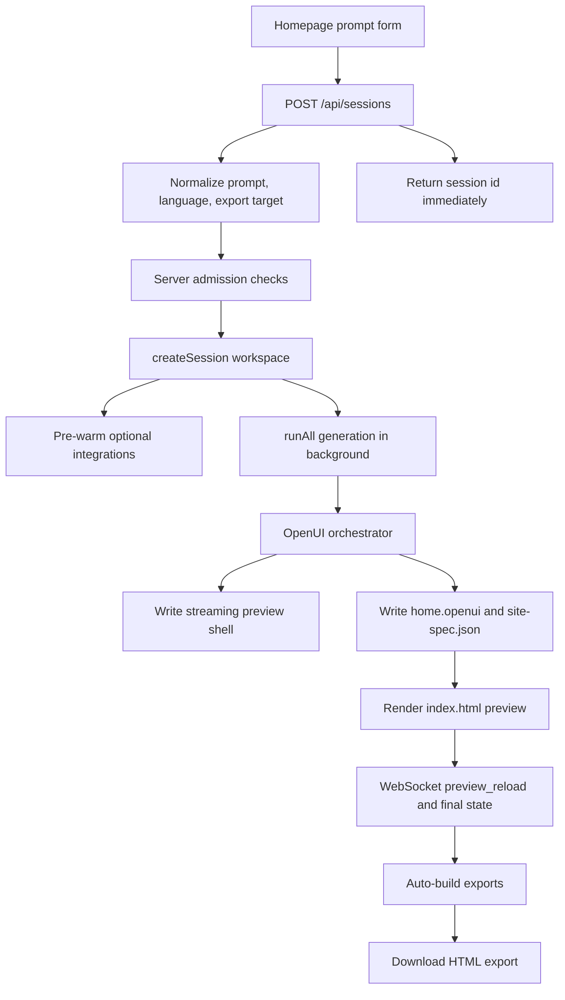
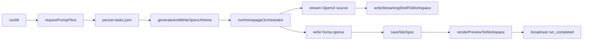
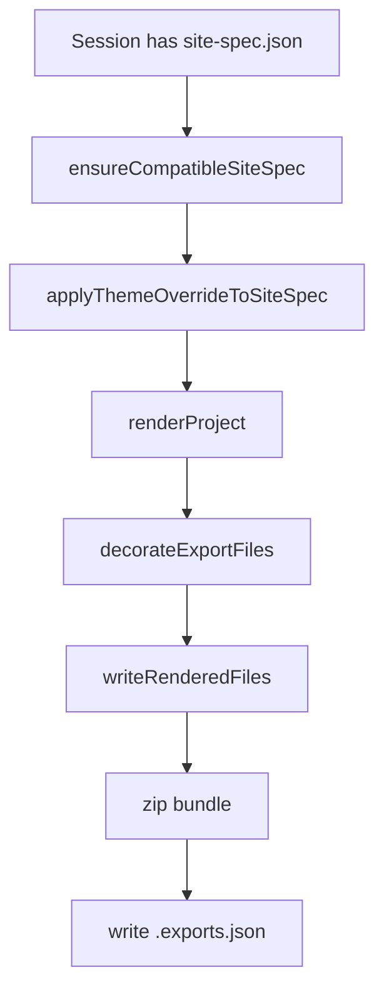

# Ship Fast Generation Architecture

Date: 2026-06-05

Scope: public prompt-to-preview flow, session state, generated artifacts, exports, and launch-critical integrations.

## System Shape

Ship Fast is a Bun/Express app that serves the public homepage, accepts generation requests, streams generation state to the dashboard over WebSockets, writes every generated project into a per-session workspace, and exports the canonical site spec to downloadable project bundles.

The launch path is intentionally local-first and file-backed:

- Runtime entrypoint: `src/index.js` starts `startServer()` from `src/server/index.js`.
- Public request router: `src/server/index.js`.
- Session persistence and recovery: `src/server/sessions.js`.
- Generation engine: `packages/ship-fast-engine/src/pipeline/runner.js`.
- OpenUI home generation: `packages/ship-fast-engine/src/pipeline/phase-openui-home.ts`.
- Preview/render/export layer: `src/server/exports.js`, `src/renderers/index.js`, and `packages/ship-fast-engine/src/renderers/index.ts`.
- Dashboard live state: `src/server/websocket.js` plus `src/scripts/dashboard-main.ts`.

## Request Flow

Admission checks are route-level today. `POST /api/sessions` applies prompt normalization, content policy, authenticated/private generation rules, monthly/daily/concurrent rate limits, free/paid limits, cache-hit lookup, and client IP handling before creating a session.

## Session Workspace Contract

Each session owns a directory under `sessions/<sessionId>/`. The workspace is both the runtime state store and the recovery source after process restart.

Important files:

- `.session.json`: preferred export target, preferred language, and privacy flag.
- `.anon-owner`: per-session secret for anonymous owners.
- `prompt.txt` or recovered prompt sources: prompt recovery fallback.
- `tasks.json`: generation task status for the dashboard.
- `home.openui`: final OpenUI source for the home page.
- `openui-manifest.json`: OpenUI page manifest.
- `site-spec.json`: canonical generated project object.
- `index.html`: rendered preview served under `/preview/:sessionId`.
- `generation-metrics.json`: elapsed time, cost, status, and user/client metadata.
- `.exports.json`: export cache metadata keyed by target and badge mode.
- `exports/<target>/` and `exports/<target>.zip`: generated bundles.

`src/server/sessions.js` reconstructs in-memory session objects from those artifacts. If `site-spec.json`, `index.html`, `home.openui`, or `tasks.json` exists, the workspace is considered recoverable.

## Generation Flow Dependencies

`runAll()` is the current generation entrypoint. The legacy multi-phase text pipeline has been removed from this path; `runAll()` now manages a single OpenUI task:

`generateAndWriteOpenUIHome()` emits streaming events while the model assembles the OpenUI program. On first source, it writes a themed preview shell and signals `homepage_ready`; on final source, it writes `home.openui`, updates `site-spec.json`, renders `index.html`, sends `openui_stream_done`, and broadcasts `preview_reload`.

## Live Dashboard State

The dashboard consumes session state from two paths:

- Initial HTTP: `/session/:id`, `/api/sessions/:id`, and preview routes read session/workspace artifacts.
- Live WebSocket: `setupWebSocket()` attaches clients by `?session=<id>` and replays prompt, status, tasks, site spec readiness, homepage readiness, OpenUI stream replay messages, theme overrides, and deployment state.

The server broadcasts:

- `status` and `log` from the runner.
- `tasks_loaded` / task updates from session state.
- `openui_stream_start`, `openui_stream_chunk`, and `openui_stream_done`.
- `homepage_ready`, `site_spec_ready`, `preview_reload`, and `generation_timing_final`.
- `export_ready` after auto-builds finish.

The dashboard should treat durable workspace files as the source of truth and WebSocket events as the fast UI path.

## Export Flow

Exports are driven by `src/server/exports.js`.

`SUPPORTED_EXPORT_TARGETS` is the contract for available targets. The active root renderer currently supports HTML output in `src/renderers/index.js`; the engine package also contains richer renderer code and tests for HTML/React/Next.js paths. Free exports inject the Ship Fast badge, and paid exports use badge-free cache entries.

## Integration Edges

- Auth: Firebase Admin helpers gate authenticated routes and paid/private behavior.
- Billing: Stripe and Razorpay handlers activate subscriptions and unlock paid export/generation paths.
- Monitoring: generation metrics append to `generation-usage.jsonl`; Slack/Telegram follow-up notifications are sent by `src/server/generation-monitoring.js`.
- Sanity CMS: optional per-session pre-warm provisions a tenant project and later syncs site settings back into `site-spec.json`.
- Medusa: optional ecommerce pre-warm provisions tenant backend/admin state when prompts look ecommerce.
- Deployments: deployment registry records generated public deployment URLs and broadcasts dashboard deployment events.
- GitHub export: `src/server/github.js` pushes generated files when the user connects a GitHub token.

## Bottlenecks And Risks

The current architecture is launch-pragmatic, but several surfaces should be kept in mind:

- Admission policy is concentrated in `src/server/index.js`; auth, quota, private-mode, prompt policy, and notification side effects are interleaved.
- File-backed state is inspectable and robust for one process, but multi-instance production needs a durable shared datastore for sessions, quotas, usage, and export metadata.
- Dashboard correctness depends on both WebSocket events and disk artifacts. Any new preview event should have a matching durable artifact or recovery path.
- Export cache keys must include every visible output variant: target, badge mode, source hash, theme override, and future renderer version.
- Optional integration pre-warms are best-effort and should never block session creation unless the user explicitly enters that integration flow.

See `docs/architecture-bottlenecks.md` for the short launch bottleneck checklist.
