# Dogfood Report: Ship Fast

| Field       | Value                                                                                                                             |
| ----------- | --------------------------------------------------------------------------------------------------------------------------------- |
| **Date**    | 2026-06-24                                                                                                                        |
| **App URL** | http://127.0.0.1:3000/                                                                                                            |
| **Session** | ship-fast-dogfood                                                                                                                 |
| **Scope**   | Homepage generation flow, dashboard/preview navigation smoothness, console/runtime failures, and visible performance regressions. |

## Summary

| Severity  | Count  |
| --------- | ------ |
| Critical  | 0      |
| High      | 7      |
| Medium    | 48     |
| Low       | 0      |
| **Total** | **55** |

## Issues

### ISSUE-001: Generate click stayed on homepage with no visible transition

| Field           | Value                                    |
| --------------- | ---------------------------------------- |
| **Severity**    | high                                     |
| **Category**    | ux / performance                         |
| **URL**         | http://127.0.0.1:3000/                   |
| **Repro Video** | dogfood-output/videos/generate-flow.webm |

**Description**

Before the fix, clicking Generate with a substantive prompt disabled the button but left the user on the homepage for more than 20 seconds. There was no intro animation, no dashboard transition, no visible error, and no session creation request visible in the request log. This directly contradicted the desired optimistic launch behavior.

**Status**

Fixed in this pass. The homepage now mounts the existing intro loader immediately while submission is pending, closes prompt suggestions on submit, aborts prompt-helper work during launch, and prewarms the intro-loader chunk after the user begins typing. Verification screenshot: `dogfood-output/screenshots/generate-loader-prewarmed.png`. Post-click request log after prewarm showed only `launch.mp3` and favicon requests, not the intro-loader module fetch.

**Repro Steps**

1. Navigate to `http://127.0.0.1:3000/`.
   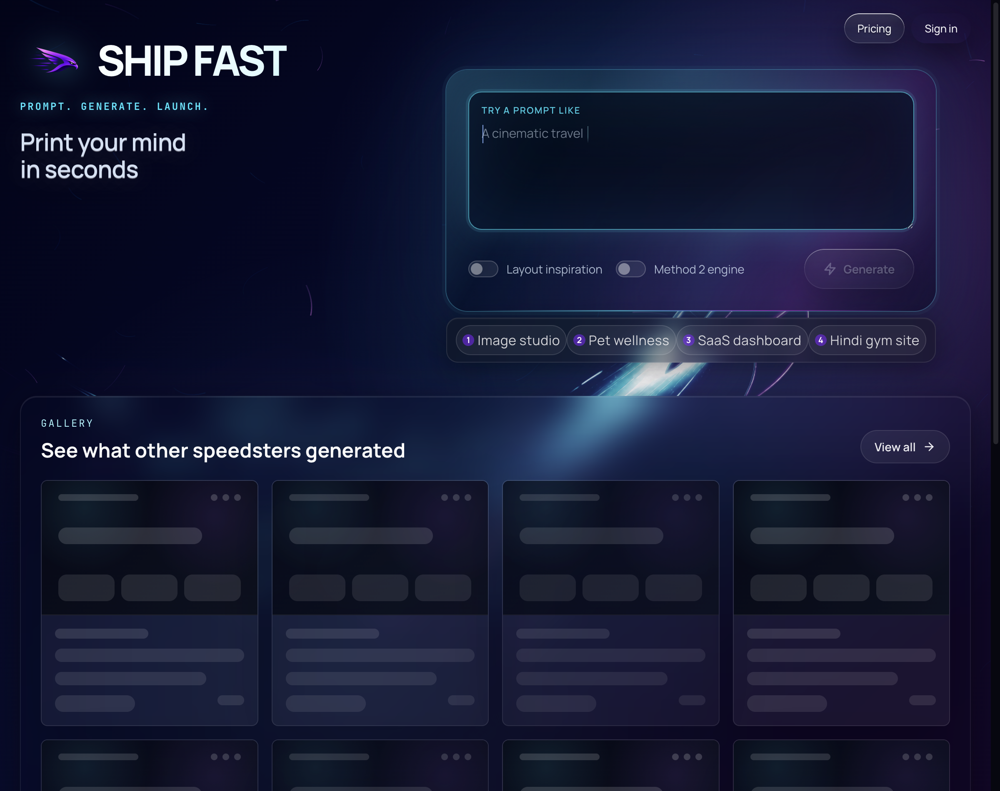

2. Fill the homepage prompt with a realistic website brief.
   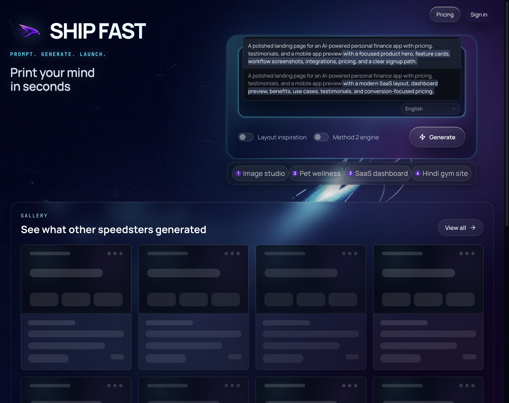

3. Click Generate.
   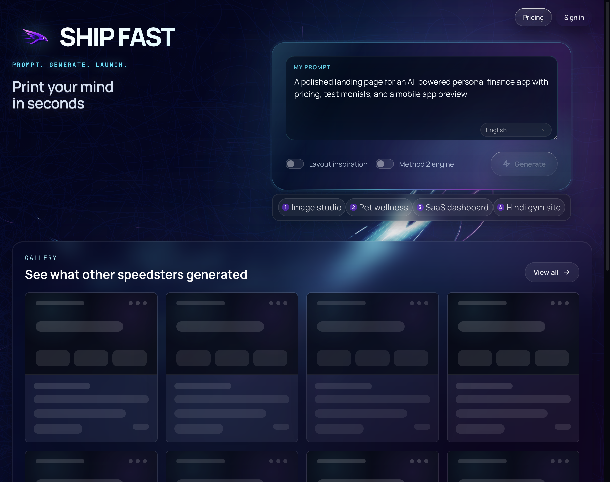

4. **Observe before fix:** the page remains on the homepage after waiting; the Generate button is disabled and no transition is visible.
   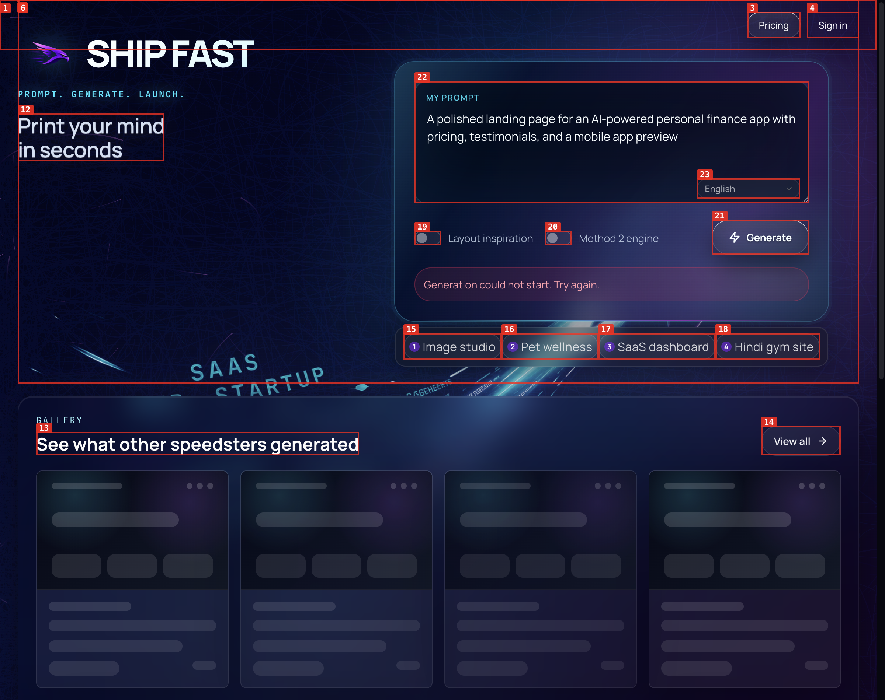

---

### ISSUE-002: Repeated websocket reconnect logs during idle homepage use

| Field           | Value                  |
| --------------- | ---------------------- |
| **Severity**    | medium                 |
| **Category**    | console / performance  |
| **URL**         | http://127.0.0.1:3000/ |
| **Repro Video** | N/A                    |

**Description**

The console repeatedly logs `WebSocket closed with code 1006` followed by reconnect attempts while the homepage is idle. This creates noisy diagnostics and may contribute to perceived dev-mode slowness. A narrowed source search did not find these strings in first-party `src/` files, so the current evidence points to a dependency/runtime connection rather than a local log statement.

**Status**

Fixed in this pass. The public gallery controller no longer opens a live Convex subscription on homepage/gallery loads; it uses the cached REST endpoint instead and falls back to an empty gallery payload if the backend is unavailable. Verification screenshots: `dogfood-output/screenshots/home-websocket-rest-fallback-after.png` and `dogfood-output/screenshots/gallery-websocket-after-rest-controller.png`. The final console logs show no Convex websocket reconnect messages after the deferred gallery mounts.

**Repro Steps**

1. Load `http://127.0.0.1:3000/` and wait for network idle.
   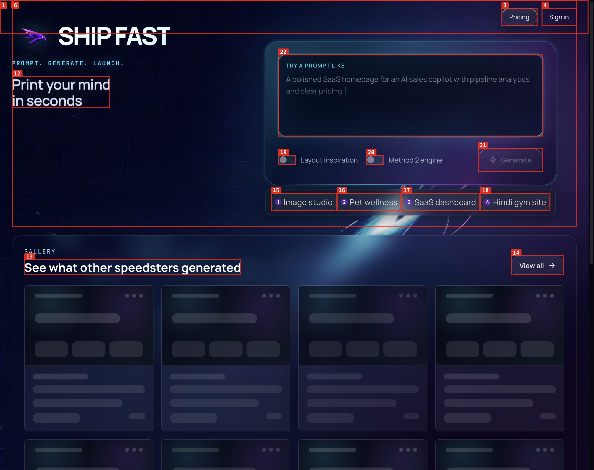

2. Open the browser console log through agent-browser.

3. **Observe:** repeated websocket close/reconnect messages in the console output.

---

### ISSUE-003: Back to home performed a visible reload instead of an iOS-like SPA transition

| Field           | Value                                          |
| --------------- | ---------------------------------------------- |
| **Severity**    | high                                           |
| **Category**    | ux / performance                               |
| **URL**         | http://127.0.0.1:3000/generate/missing-session |
| **Repro Video** | N/A                                            |

**Description**

Before the fix, returning from the dashboard to the homepage used `window.location.href = '/'`, which forces a document navigation and makes the homepage feel like it is loading again. This was visible in the request log and contradicted the requested instant navigation feel.

**Status**

Fixed in this pass. The dashboard Back action now uses TanStack Router SPA navigation, and the dashboard prewarms the home route, lazy auth/gallery modules, and home imagery while idle. Verification screenshot: `dogfood-output/screenshots/dashboard-back-home-warmed-final.png`. Post-click request logs showed no document request, no route script fetch, no `HomepageAuthControls` fetch, and no `PublicGallery` fetch.

**Repro Steps**

1. Navigate to `http://127.0.0.1:3000/generate/missing-session` and wait for the dashboard shell.
   

2. Click Back to home.
   

3. **Observe before fix:** the browser performs a hard navigation and visibly reloads homepage resources instead of a smooth SPA transition.

---

### ISSUE-004: Dashboard fallback polling leaked failed session requests into navigation

| Field           | Value                                          |
| --------------- | ---------------------------------------------- |
| **Severity**    | medium                                         |
| **Category**    | performance / console                          |
| **URL**         | http://127.0.0.1:3000/generate/missing-session |
| **Repro Video** | N/A                                            |

**Description**

While testing the dashboard return path, the request log showed repeated `GET /api/sessions/missing-session` failures continuing around the Back transition. In dev mode this adds avoidable request noise and makes the page feel busier during navigation.

**Status**

Fixed in this pass. The fallback poller now aborts in-flight requests on cleanup and stops polling after a missing session or repeated failed responses. Verification screenshot: `dogfood-output/screenshots/dashboard-idle-prewarm-after-timeout.png`. The final post-click request log contained no `/api/sessions/missing-session` requests after returning home.

**Repro Steps**

1. Navigate to `http://127.0.0.1:3000/generate/missing-session`.
   

2. Wait several seconds, clear the request log, then click Back to home.
   

3. **Observe before fix:** repeated failed `/api/sessions/missing-session` requests appear during or after the home transition.

---

### ISSUE-005: Homepage Pricing link hard-reloaded the app and loaded route chunks on click

| Field           | Value                  |
| --------------- | ---------------------- |
| **Severity**    | high                   |
| **Category**    | ux / performance       |
| **URL**         | http://127.0.0.1:3000/ |
| **Repro Video** | N/A                    |

**Description**

Before the fix, clicking the homepage Pricing pill used a plain document navigation. The request log showed a `Document` request for `/pricing`, a full app/runtime reload, duplicate Vite connection logs, and pricing route modules fetched during the click. This made marketing navigation feel like a page load instead of an in-app transition.

**Status**

Fixed in this pass. Internal glass-pill and pricing-shell links now use TanStack Router links. The homepage prewarms the pricing route, pricing modules, and pricing font faces while idle, without running that prewarm when the user is actively typing a prompt. Verification screenshots: `dogfood-output/screenshots/marketing-pricing-final-prewarmed-after.png`, `dogfood-output/screenshots/marketing-pricing-no-click-requests-after.png`, and `dogfood-output/screenshots/marketing-pricing-logo-home-after.png`. The final click request log contained only the agent-browser console-pipe request.

**Repro Steps**

1. Navigate to `http://127.0.0.1:3000/`.
   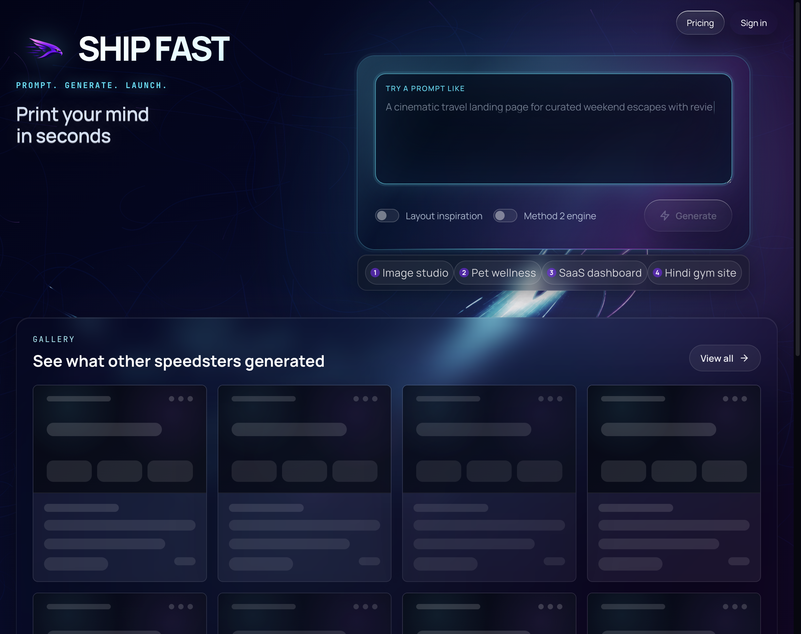

2. Click the Pricing pill in the top navigation.
   

3. **Observe before fix:** the browser performs a document navigation and reloads the app/runtime instead of an SPA transition.

4. **Observe after fix:** the URL changes to `/pricing` through SPA navigation, with pricing resources warmed before click and no app route/module requests after click.
   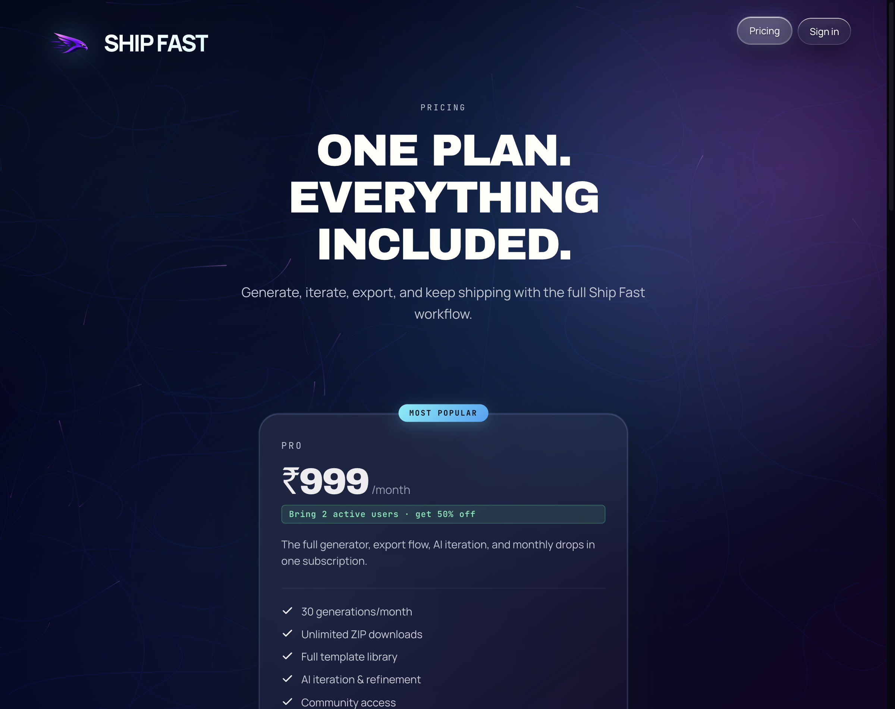

---

### ISSUE-006: Public gallery fallback surfaced a 500 on idle homepage load

| Field           | Value                  |
| --------------- | ---------------------- |
| **Severity**    | medium                 |
| **Category**    | performance / console  |
| **URL**         | http://127.0.0.1:3000/ |
| **Repro Video** | N/A                    |

**Description**

After moving public gallery data off live Convex subscriptions, the idle homepage still issued `GET /api/sessions/recent?limit=12&page=1` and received a 500 when the backend was unavailable locally. That removed websocket noise but still left a failed request on a non-critical public page.

**Status**

Fixed in this pass. The public gallery API now returns a cached 200 empty-gallery payload when the backend query fails. Verification screenshot: `dogfood-output/screenshots/home-gallery-api-fallback-200-after.png`. The final browser request log shows `/api/sessions/recent?limit=12&page=1` returning 200, and the gallery grid exits its loading state.

**Repro Steps**

1. Navigate to `http://127.0.0.1:3000/` and wait for the deferred homepage gallery to mount.
   

2. Inspect network requests for `/api/sessions/recent?limit=12&page=1`.

3. **Observe before fix:** the public gallery request returns 500.

4. **Observe after fix:** the same request returns 200 with an empty gallery payload when the backend is unavailable.
   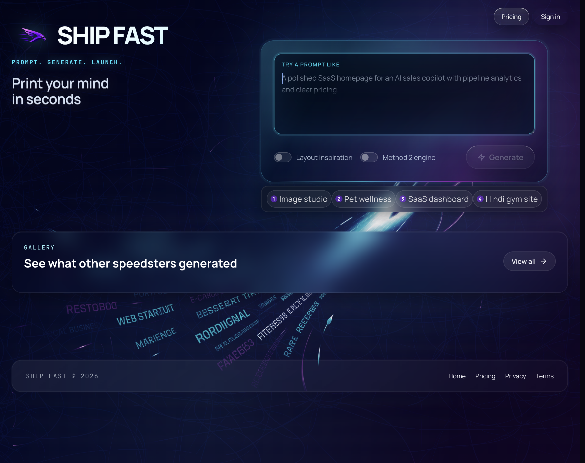

---

### ISSUE-007: Homepage loaded Clerk/auth resources before any auth action

| Field           | Value                  |
| --------------- | ---------------------- |
| **Severity**    | medium                 |
| **Category**    | performance / auth     |
| **URL**         | http://127.0.0.1:3000/ |
| **Repro Video** | N/A                    |

**Description**

Before the fix, the public homepage booted Clerk at the root even when the user had not clicked Sign in. The console showed the Clerk development-key warning, the request log included local Clerk chunks plus external `accounts.dev` resources, and `window.Clerk` was already present after an idle homepage load. That put avoidable auth and external network work on the critical public-home path.

**Status**

Fixed in this pass. The root route no longer imports or wraps Clerk. Authenticated Convex routes load Clerk through the lazy route-gated provider, homepage sign-in controls mount only after the user clicks Sign in, and pricing shell top actions no longer import Clerk at module load. Verification screenshots: `dogfood-output/screenshots/home-auth-after-no-clerk.png` and `dogfood-output/screenshots/home-auth-click-modal-after.png`. The idle homepage check returned `clerkLoaded: false`, no Clerk scripts, and no Clerk/account resources; after clicking Sign in, Clerk loaded and the modal opened.

**Repro Steps**

1. Navigate to `http://127.0.0.1:3000/` and wait several seconds.
   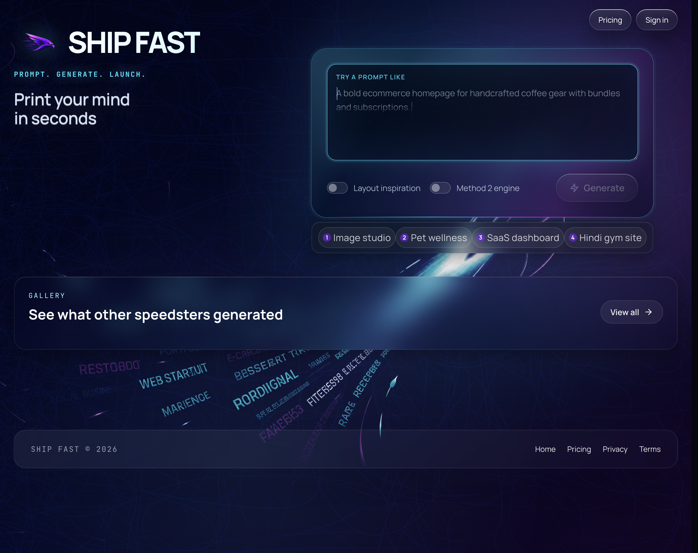

2. Inspect console and network activity for Clerk or `accounts.dev` resources.

3. **Observe before fix:** Clerk scripts and external auth resources load before the user requests auth, and the console logs the Clerk development-key warning.

4. **Observe after fix:** no Clerk resources are present on idle homepage; clicking Sign in loads Clerk on demand and opens the modal.
   

---

### ISSUE-008: Public gallery loaded generated-preview/editor code on idle homepage

| Field           | Value                  |
| --------------- | ---------------------- |
| **Severity**    | medium                 |
| **Category**    | performance / bundle   |
| **URL**         | http://127.0.0.1:3000/ |
| **Repro Video** | N/A                    |

**Description**

After the deferred homepage gallery mounted, the public gallery module statically imported `GeneratedModulePreview`. That pulled `GeneratedModulePreview`, `DirectPreview`, Lakebed, theme-apply, and edit-helper resources into an idle public homepage even when the local gallery response was empty. This was avoidable work on the page the user described as laggy.

**Status**

Fixed in this pass. The generated module preview renderer is now lazy-loaded only for gallery cards that actually have module source. Verification screenshots: `dogfood-output/screenshots/home-idle-heavy-prewarm-before.png` and `dogfood-output/screenshots/home-idle-lazy-gallery-after.png`. The final idle homepage check returned an empty `previewResources` list while still allowing the public gallery shell to load.

**Repro Steps**

1. Navigate to `http://127.0.0.1:3000/` and wait for the deferred gallery to mount.
   

2. Inspect network resources for generated preview/editor modules.

3. **Observe before fix:** `GeneratedModulePreview`, `DirectPreview`, Lakebed, theme-apply, and edit-helper modules load on idle homepage.

4. **Observe after fix:** the same idle page has no generated-preview/editor/Lakebed resources.
   

---

### ISSUE-009: Public Pricing route loaded Clerk before auth was requested

| Field           | Value                         |
| --------------- | ----------------------------- |
| **Severity**    | medium                        |
| **Category**    | performance / auth            |
| **URL**         | http://127.0.0.1:3000/pricing |
| **Repro Video** | N/A                           |

**Description**

After fixing homepage auth loading, clicking Pricing still triggered the route-gated Clerk provider because `/pricing` was marked as an authenticated-provider route. The pricing page is static marketing content, so navigation to it loaded Clerk chunks and external `accounts.dev` requests before the user clicked Sign in.

**Status**

Fixed in this pass. `/pricing` no longer opts into authenticated providers. The shared top Sign in button now loads Clerk on demand, retries until Clerk UI is ready, and opens the modal without requiring route-level auth. Verification screenshots: `dogfood-output/screenshots/pricing-public-no-auth-after.png` and `dogfood-output/screenshots/pricing-signin-on-demand-fixed.png`. The final Pricing click produced no Clerk resources; clicking Sign in then loaded Clerk and opened the modal.

**Repro Steps**

1. Navigate to `http://127.0.0.1:3000/`, wait for pricing prewarm, clear resource timings, then click Pricing.
   

2. Inspect resources loaded after the Pricing click.

3. **Observe before fix:** Clerk chunks and `accounts.dev` requests load immediately on `/pricing`.

4. **Observe after fix:** no Clerk resources load on Pricing navigation; they load only after clicking Sign in, and the sign-in modal opens.
   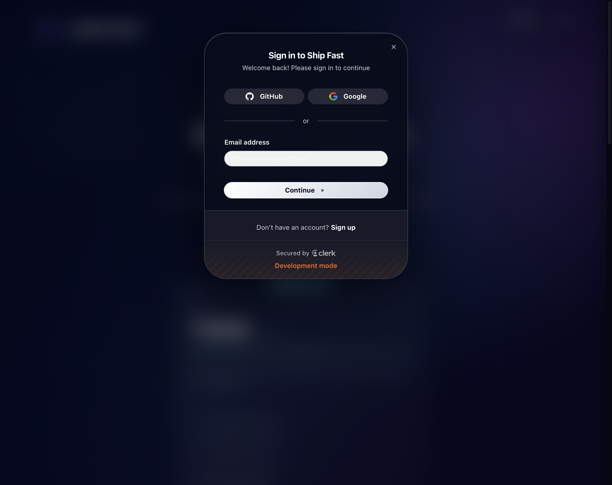

---

### ISSUE-010: Direct Pricing loads pulled the homepage generator stack

| Field           | Value                         |
| --------------- | ----------------------------- |
| **Severity**    | medium                        |
| **Category**    | performance / bundle          |
| **URL**         | http://127.0.0.1:3000/pricing |
| **Repro Video** | N/A                           |

**Description**

A direct public Pricing load imported the homepage route component and pulled homepage-only generation modules into the marketing route: `HomePage`, `usePromptHomeController`, prompt suggestions, home icons, private generation modal, and share bonus panel. Pricing only needs shared glass primitives, so this made a static marketing route pay part of the homepage generator cost.

**Status**

Fixed in this pass. Pricing shell and top actions import glass primitives directly from `GlassPill`, and the `/` route uses `lazyRouteComponent` so the route tree can load the index route stub without loading the homepage generator. Verification screenshots: `dogfood-output/screenshots/pricing-direct-home-import-before.png`, `dogfood-output/screenshots/pricing-direct-no-home-import-after.png`, and `dogfood-output/screenshots/pricing-home-lazy-load-after.png`. Direct `/pricing` now has no homepage generation resources, while clicking Home still lazy-loads the homepage correctly.

**Repro Steps**

1. Navigate directly to `http://127.0.0.1:3000/pricing`.
   

2. Inspect loaded resources for homepage generation modules.

3. **Observe before fix:** the Pricing page loads `HomePage`, prompt controller, prompt suggestions, private modal, share panel, and home icons.

4. **Observe after fix:** direct Pricing loads only the route stub and shared glass primitives, with no homepage generation resources.
   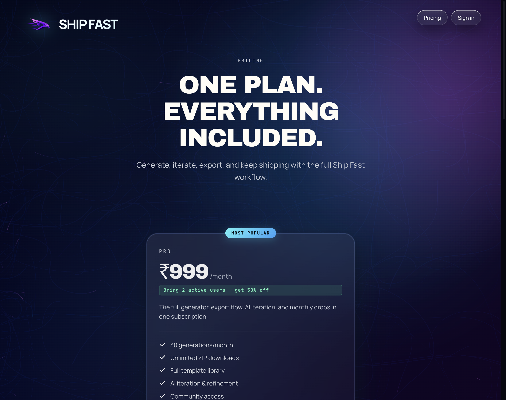

---

### ISSUE-011: Homepage route tree eagerly loaded public Pricing and Gallery components

| Field           | Value                  |
| --------------- | ---------------------- |
| **Severity**    | medium                 |
| **Category**    | performance / bundle   |
| **URL**         | http://127.0.0.1:3000/ |
| **Repro Video** | N/A                    |

**Description**

During the first second of a homepage load, the route tree pulled public route components that were not currently visible: Pricing loaded `PricingPage`, `MarketingShell`, pricing HTML/CSS, and top actions; Gallery loaded `PublicGallery` and `useGalleryController`. This happened at roughly 200ms in the resource timeline, before the homepage idle prewarm/deferred gallery behavior should run, adding avoidable work to the initial public-home path.

**Status**

Fixed in this pass. `/pricing` and `/gallery` now use `lazyRouteComponent`, matching the existing generated-dashboard lazy route pattern. The route stubs can still register in the tree, while the route components load only when matched or explicitly prewarmed. Verification screenshots: `dogfood-output/screenshots/home-eager-route-load-before.png`, `dogfood-output/screenshots/home-eager-route-load-after.png`, `dogfood-output/screenshots/pricing-lazy-route-direct-after.png`, and `dogfood-output/screenshots/gallery-lazy-route-direct-after.png`. Direct Pricing and Gallery entry still render correctly.

**Repro Steps**

1. Navigate to `http://127.0.0.1:3000/` and inspect resource start times within the first second.
   

2. **Observe before fix:** Pricing and Gallery component resources load during the initial homepage route-tree load.

3. **Observe after fix:** public route components are lazy; the homepage keeps those heavy modules out of the initial phase, and direct `/pricing` and `/gallery` still render when matched.
   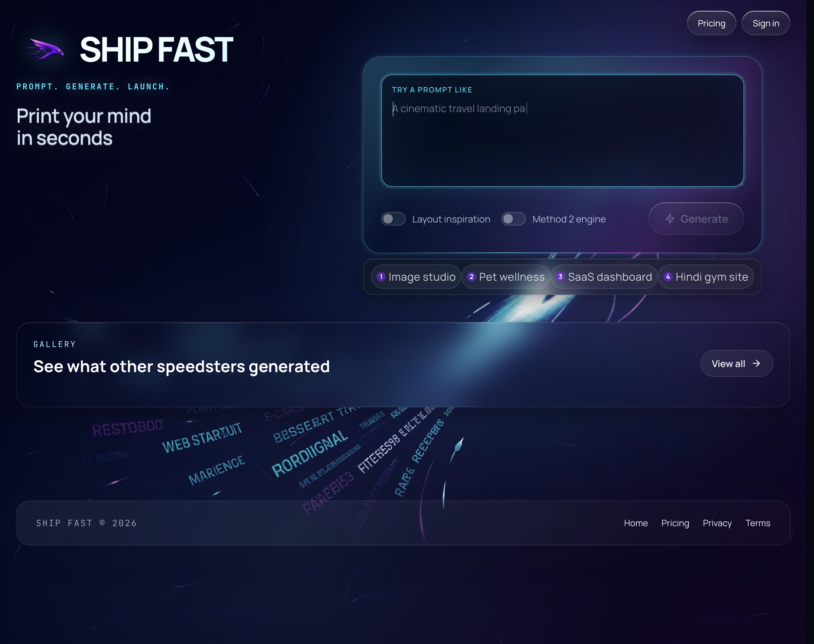

---

### ISSUE-012: Closed homepage overlays loaded during initial homepage render

| Field           | Value                  |
| --------------- | ---------------------- |
| **Severity**    | medium                 |
| **Category**    | performance / bundle   |
| **URL**         | http://127.0.0.1:3000/ |
| **Repro Video** | N/A                    |

**Description**

The initial homepage render loaded `PrivateGenerationModal` and `ShareBonusPanel` at roughly 214ms even though neither overlay was visible. Both are closed-by-default UI: the private-generation modal is behind the Pro private-generation control, and the share bonus panel appears only after a quota-exhaustion state.

**Status**

Fixed in this pass. The modal and share panel are now lazy-loaded only when their corresponding state is active, and the share click helper is imported only when a share action happens. Verification screenshots: `dogfood-output/screenshots/home-closed-overlays-before.png` and `dogfood-output/screenshots/home-closed-overlays-after.png`. The final initial homepage check returned an empty `overlayResources` list while the normal prompt UI remained visible.

**Repro Steps**

1. Navigate to `http://127.0.0.1:3000/` and inspect loaded resources during initial render.
   

2. **Observe before fix:** `PrivateGenerationModal` and `ShareBonusPanel` load even though no modal or share panel is visible.

3. **Observe after fix:** the initial homepage no longer loads either closed-overlay module.
   

---

### ISSUE-013: Public Pricing route loaded Convex before any data path needed it

| Field           | Value                          |
| --------------- | ------------------------------ |
| **Severity**    | medium                         |
| **Category**    | performance / provider-loading |
| **URL**         | http://127.0.0.1:3000/pricing  |
| **Repro Video** | N/A                            |

**Description**

After removing eager Clerk and homepage generator work from direct Pricing loads, the static `/pricing` page still loaded Convex provider/runtime resources around 150ms: `convex_react`, generated `api`, `ConvexAuthState`, and browser runtime chunks. Pricing does not call Convex hooks until the user leaves the marketing page, so this paid backend-provider startup cost on a purely public route.

**Status**

Fixed in this pass. The root provider no longer statically imports `convex/react` or creates a Convex client for every public route. Anonymous Convex and Clerk+Convex providers now live behind lazy route-gated modules, and only `/` plus `/generate/...` opt into Convex because those routes call Convex hooks directly. Verification screenshots: `dogfood-output/screenshots/pricing-convex-provider-before.png` and `dogfood-output/screenshots/pricing-convex-provider-after.png`. The final direct Pricing check returned no Convex resources and no Clerk resources while the pricing UI remained visible.

**Repro Steps**

1. Navigate directly to `http://127.0.0.1:3000/pricing`.
   

2. Inspect loaded resources for Convex modules.

3. **Observe before fix:** Convex provider/runtime chunks load even though Pricing is static marketing UI.

4. **Observe after fix:** direct Pricing renders without Convex or Clerk resources.
   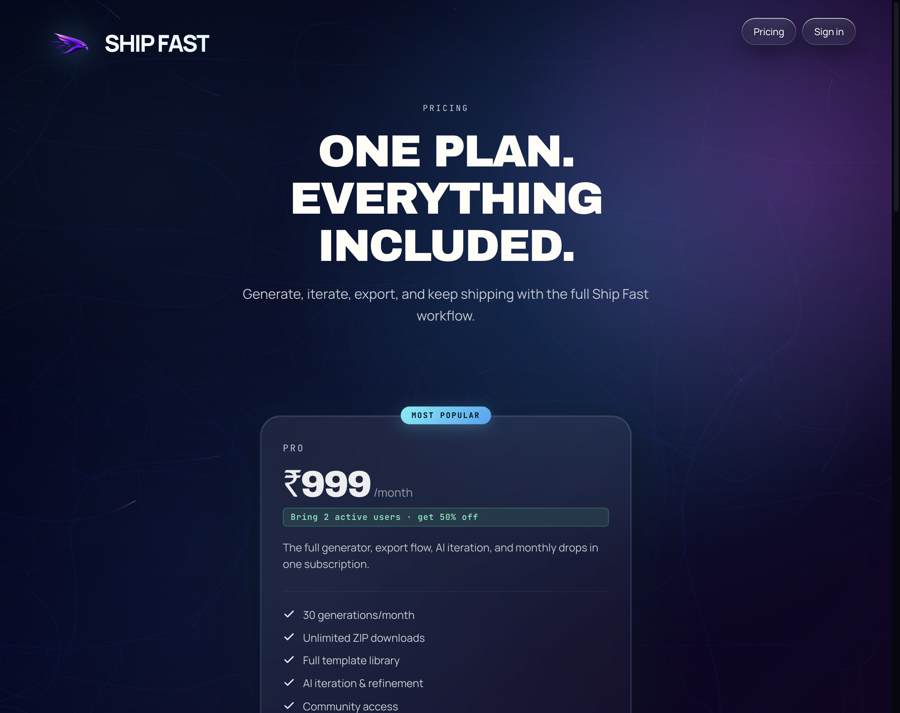

---

### ISSUE-014: Anonymous dashboard loaded Clerk before a sign-in action

| Field           | Value                                                  |
| --------------- | ------------------------------------------------------ |
| **Severity**    | medium                                                 |
| **Category**    | performance / auth                                     |
| **URL**         | http://127.0.0.1:3000/generate/session_auth_lazy_smoke |
| **Repro Video** | N/A                                                    |

**Description**

The generated-site dashboard is primarily an anonymous workspace while a session is being created or previewed. Even after route-level Clerk providers were removed, the dashboard still fetched Clerk chunks because `useOptionalAuth` statically imported Clerk React hooks, and dashboard idle prewarm imported `HomepageAuthControls`. This made an anonymous preview workspace pay auth-library cost before the user clicked an auth-gated action.

**Status**

Fixed in this pass. Optional auth now reads the global Clerk SDK only if it already exists, and dispatches a lightweight sign-in event instead of importing Clerk hooks. A small root `SignInModalHost` listens for that event and lazy-loads the existing `HomepageAuthControls` modal only on demand. Dashboard home prewarm still warms the home route, gallery, and imagery, but no longer prewarms the auth control. Verification screenshots: `dogfood-output/screenshots/dashboard-auth-lazy-initial-after.png` and `dogfood-output/screenshots/dashboard-auth-on-demand-after.png`. The clean dashboard resource check returned `clerkResources: []`; dispatching the sign-in event then loaded Clerk resources and displayed the existing sign-in modal.

**Repro Steps**

1. Navigate directly to a generated dashboard URL, such as `http://127.0.0.1:3000/generate/session_auth_lazy_clean`.
   

2. Inspect loaded resources.

3. **Observe before fix:** Clerk hook/runtime resources load during anonymous dashboard entry.

4. **Observe after fix:** no Clerk resources load until a sign-in action is requested.

5. Trigger sign-in from an auth-gated action.
   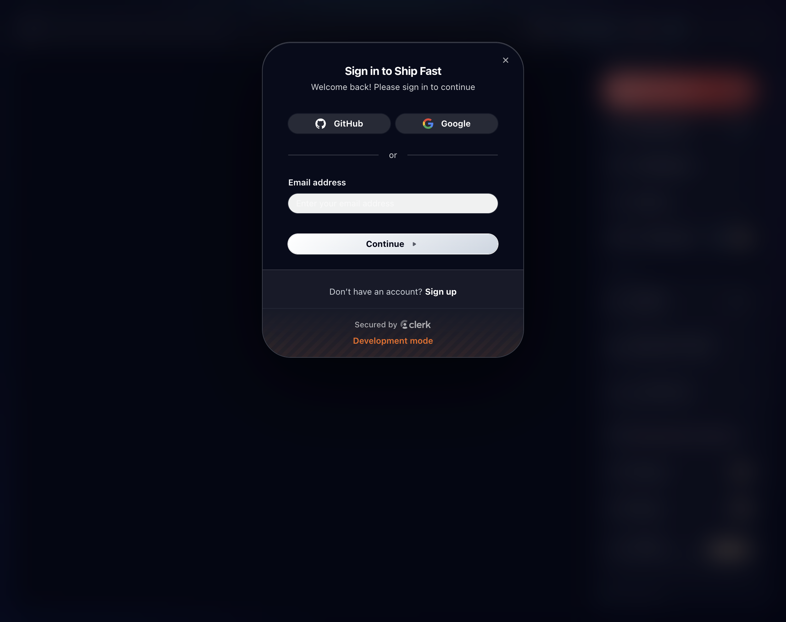

6. **Observe after fix:** the existing Clerk modal opens and Clerk resources load only at that point.

---

### ISSUE-015: Public Gallery crashed because hidden delete hotkey required Convex

| Field           | Value                         |
| --------------- | ----------------------------- |
| **Severity**    | high                          |
| **Category**    | runtime / performance         |
| **URL**         | http://127.0.0.1:3000/gallery |
| **Repro Video** | N/A                           |

**Description**

Direct `/gallery` rendered the app error boundary with `Could not find Convex client!` because `GalleryGrid` called `useMutation(api.sessions.deleteMine)` during public render. The route had correctly stopped opting into a Convex provider, but a hidden D-key delete shortcut still forced `convex/react`, generated `api`, `ConvexAuthState`, and browser runtime chunks into the initial public gallery path and then crashed because no provider was mounted.

**Status**

Fixed in this pass. The public gallery component no longer imports `convex/react` or calls `useMutation` during render. The hidden delete shortcut now dynamically imports `delete-gallery-session` only after the D-key action, using the shared runtime Convex HTTP client outside the render tree. Verification screenshots: `dogfood-output/screenshots/gallery-convex-delete-before.png` and `dogfood-output/screenshots/gallery-convex-delete-after.png`. The final direct Gallery check rendered the gallery shell, returned `hasError: false`, and had empty `convexResources`, `clerkResources`, and `deleteServiceResources` lists.

**Repro Steps**

1. Navigate directly to `http://127.0.0.1:3000/gallery`.
   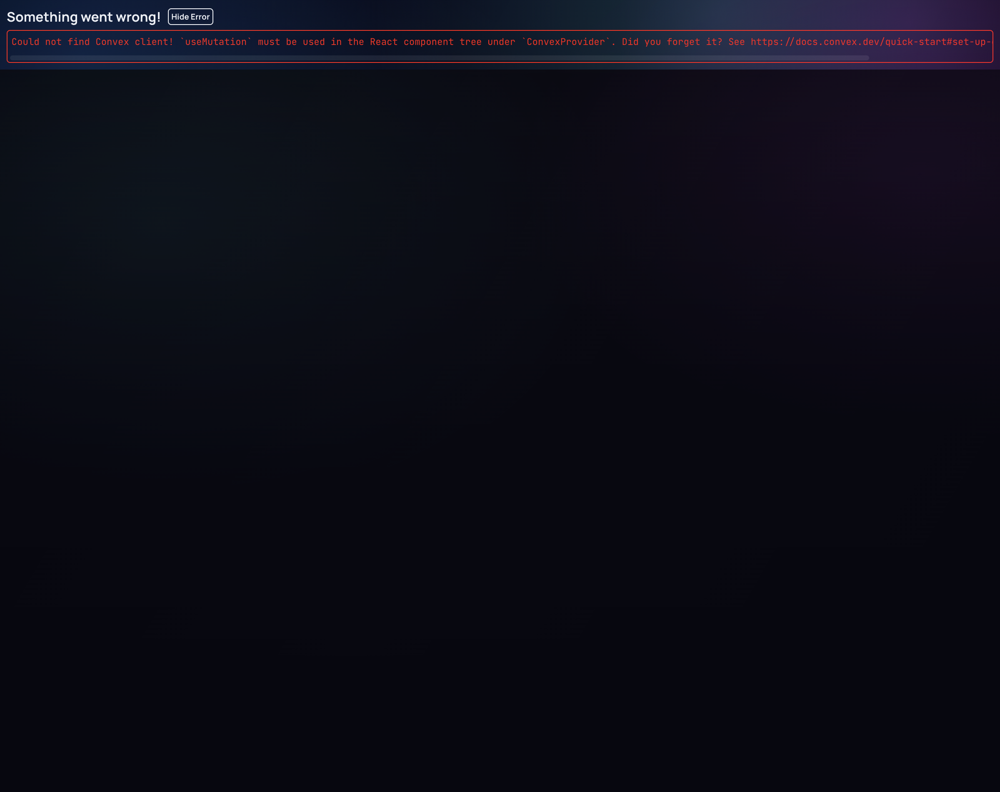

2. **Observe before fix:** the page shows the app error boundary: `Could not find Convex client!`.

3. Inspect loaded resources.

4. **Observe before fix:** Convex resources load even though the public gallery should be REST-backed.

5. **Observe after fix:** the gallery renders without the error boundary and without initial Convex or Clerk resources.
   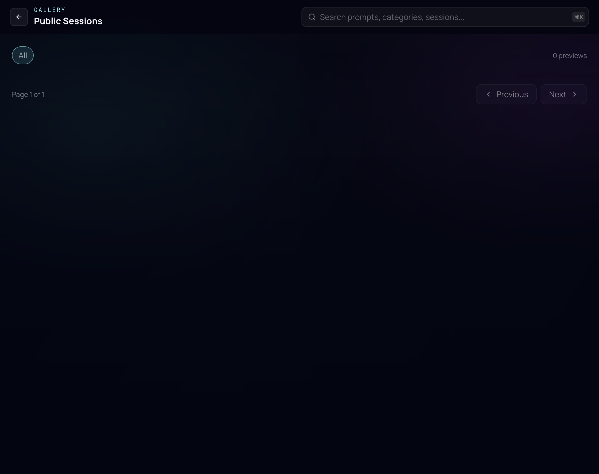

---

### ISSUE-016: Referrals page showed a sign-in requirement without a working sign-in action

| Field           | Value                           |
| --------------- | ------------------------------- |
| **Severity**    | medium                          |
| **Category**    | ux / auth / performance         |
| **URL**         | http://127.0.0.1:3000/referrals |
| **Repro Video** | N/A                             |

**Description**

After auth loading was moved out of the root provider, the public referrals page still assumed the global Clerk SDK would eventually appear. The route waited for a missing SDK, then showed `Sign in to see your referral rewards.` without a visible sign-in control. This left users blocked and wasted time waiting for auth code that intentionally no longer loads on first paint.

**Status**

Fixed in this pass. Referral auth detection now returns immediately when Clerk has not been explicitly loaded, and the signed-out referral state includes a route-local Sign in button that triggers the shared on-demand Clerk modal. Verification screenshots: `dogfood-output/screenshots/referrals-no-signin-action-before.png` and `dogfood-output/screenshots/referrals-signin-action-after.png`. The final direct Referrals check rendered the page with no Clerk resources on first paint; clicking Sign in loaded Clerk resources and opened the sign-in modal.

**Repro Steps**

1. Navigate directly to `http://127.0.0.1:3000/referrals`.
   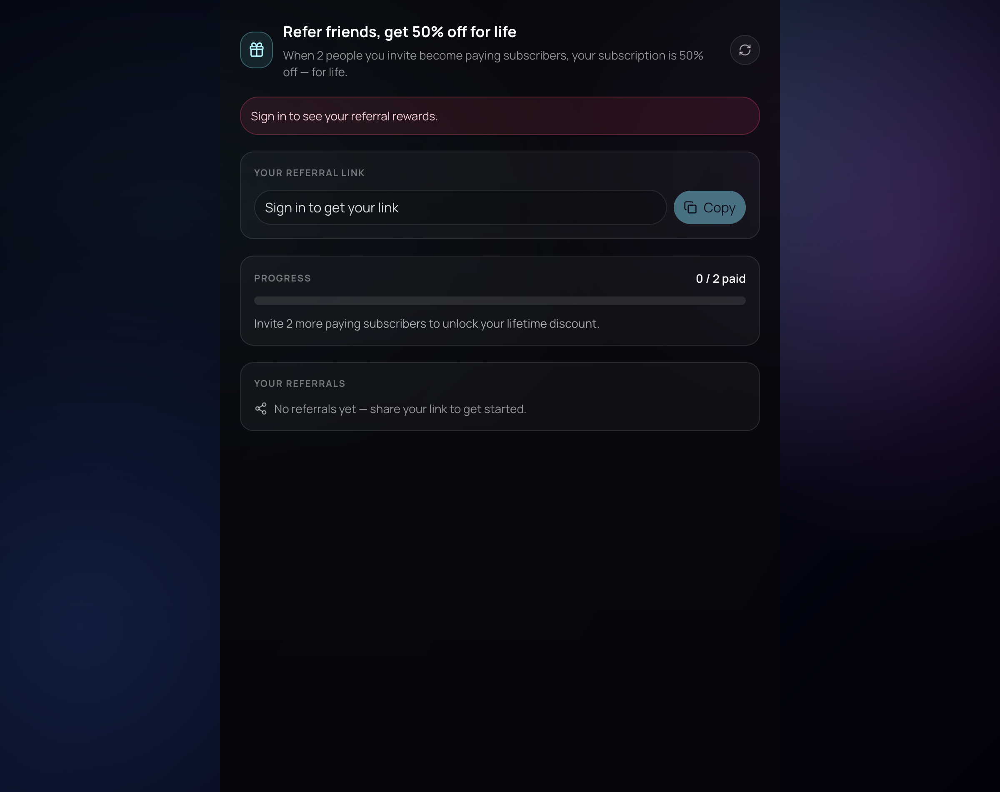

2. **Observe before fix:** the page says sign-in is required but provides no action to sign in.

3. **Observe after fix:** the route shows a Sign in button without loading Clerk during initial render.

4. Click Sign in.
   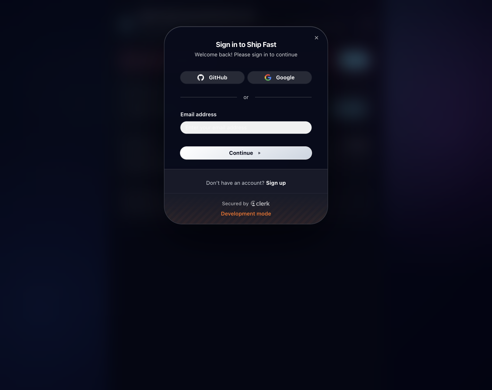

5. **Observe after fix:** the existing Clerk modal opens on demand.

---

### ISSUE-017: Homepage footer legal links used document navigation

| Field           | Value                  |
| --------------- | ---------------------- |
| **Severity**    | medium                 |
| **Category**    | ux / performance       |
| **URL**         | http://127.0.0.1:3000/ |
| **Repro Video** | N/A                    |

**Description**

The homepage footer still used plain internal anchors for Home, Pricing, Privacy, and Terms. That kept a hard-navigation path in the public homepage after the main Pricing pill and dashboard Back flows had been moved to SPA navigation. The legal route files also synchronously imported their page components instead of following the lazy public-route pattern used by Pricing and Gallery.

**Status**

Fixed in this pass. The footer now uses TanStack Router `Link` for all internal links, `/privacy` plus `/terms` lazy-load their page components, and the Terms page uses a router link for its internal Privacy policy reference. Verification screenshot: `dogfood-output/screenshots/home-footer-legal-spa-after.png`. The final browser checks clicked Privacy from the homepage footer and from the Terms page, changed the URL to `/privacy`, kept the original document navigation entry, loaded the privacy component lazily, and rendered the Privacy policy page without a document reload.

**Repro Steps**

1. Navigate to `http://127.0.0.1:3000/`.

2. Click the footer Privacy link.

3. **Observe before fix:** the footer link is a plain document anchor path instead of router navigation.

4. **Observe after fix:** the URL changes through SPA navigation and the Privacy page renders after its lazy route component loads.
   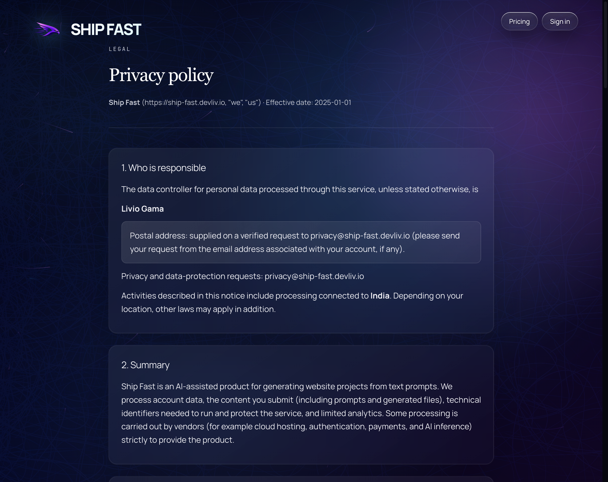

---

### ISSUE-018: Public marketing links preloaded routes at render time

| Field           | Value                         |
| --------------- | ----------------------------- |
| **Severity**    | medium                        |
| **Category**    | performance / route-loading   |
| **URL**         | http://127.0.0.1:3000/privacy |
| **Repro Video** | N/A                           |

**Description**

The shared glass-pill link wrapper and marketing shell Home links used TanStack Router `preload="render"` for internal navigation. That means a public page can begin fetching linked route modules as soon as links render, before hover/focus/tap intent. On static legal and pricing pages this is unnecessary route work, and it conflicts with the goal of keeping public surfaces calm while preserving smooth navigation.

**Status**

Fixed in this pass. Internal glass-pill links and marketing-shell Home links now use `preload="intent"`, while the homepage keeps its explicit idle prewarm for the Pricing path. Verification screenshot: `dogfood-output/screenshots/public-route-intent-preload-after.png`. The final direct `/privacy` browser check rendered the Privacy page and showed only lightweight route stubs plus the active Privacy component; no `HomePage`, prompt-controller, prompt-suggestion, private-modal, or share-panel modules loaded.

**Repro Steps**

1. Navigate directly to `http://127.0.0.1:3000/privacy`.

2. Inspect source or route resource timing for render-time internal link preloads.

3. **Observe before fix:** internal public links request route preload work at render time rather than on user intent.

4. **Observe after fix:** internal links wait for intent, while the page still renders normally.
   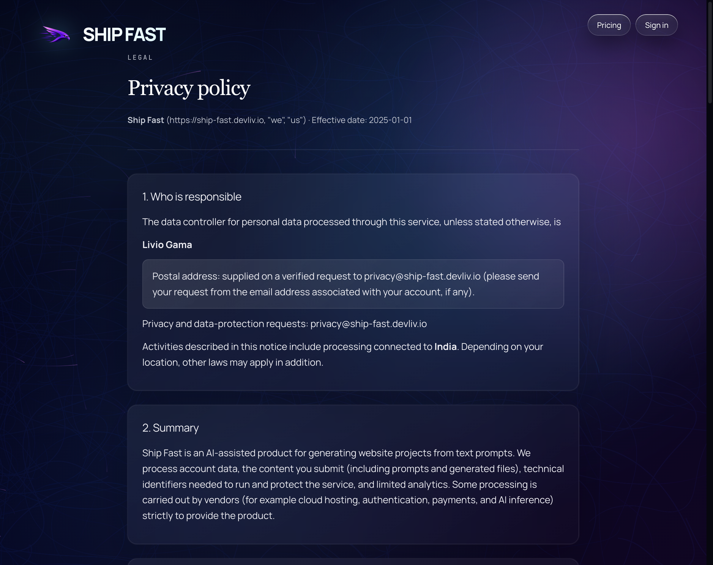

---

### ISSUE-019: Public animated backdrop remounted between marketing pages

| Field           | Value                         |
| --------------- | ----------------------------- |
| **Severity**    | medium                        |
| **Category**    | performance / animation       |
| **URL**         | http://127.0.0.1:3000/privacy |
| **Repro Video** | N/A                           |

**Description**

The animated launch backdrop was mounted independently by `HomePage` and `MarketingShell`. SPA navigation between public pages therefore tore down and recreated the canvas animation, resize listeners, particles, and animation frame loop. This matched the user-reported concern that the rocket/background layer should behave like a persistent layout layer instead of being loaded again for each screen.

**Status**

Fixed in this pass. `AppProviders` now lazily hosts one public launch backdrop for `/`, `/pricing`, `/privacy`, and `/terms`; `HomePage` and `MarketingShell` no longer mount their own backdrop copies. Verification screenshot: `dogfood-output/screenshots/public-backdrop-persistent-after.png`. The final browser check loaded `/privacy`, waited for the canvas, tagged the canvas DOM node, clicked Pricing, and confirmed `sameCanvas: true`, `beforeCanvasCount: 1`, `afterCanvasCount: 1`, and the tag persisted on `/pricing`.

**Repro Steps**

1. Navigate to `http://127.0.0.1:3000/privacy`.

2. Let the animated backdrop canvas initialize.

3. Navigate to Pricing through the in-app link.

4. **Observe before fix:** each public page owns its own backdrop mount, so the canvas animation is recreated across page transitions.

5. **Observe after fix:** one provider-owned canvas persists across public marketing route transitions.
   

---

### ISSUE-020: Private-generation upgrade link hard-navigated to Pricing

| Field           | Value                  |
| --------------- | ---------------------- |
| **Severity**    | medium                 |
| **Category**    | ux / navigation        |
| **URL**         | http://127.0.0.1:3000/ |
| **Repro Video** | N/A                    |

**Description**

The private-generation upsell modal used a plain `<a href="/pricing">` for its Upgrade to Pro action. That left a hard-navigation route to Pricing inside the homepage interaction flow, even though the rest of public marketing navigation had been moved to TanStack Router links for instant SPA transitions.

**Status**

Fixed in this pass. The modal now uses a TanStack Router `Link` with the same visual styling and text. Verification screenshot: `dogfood-output/screenshots/private-generation-upgrade-spa-after.png`. The browser check opened the homepage, triggered the existing private-generation modal control, clicked Upgrade to Pro, and confirmed the URL changed to `/pricing` while the document navigation entry stayed at `/`.

**Repro Steps**

1. Open `http://127.0.0.1:3000/`.

2. Open the private-generation upsell modal.

3. Click Upgrade to Pro.

4. **Observe before fix:** the modal action is a plain internal anchor.

5. **Observe after fix:** the action navigates to Pricing through SPA navigation.
   

---

### ISSUE-021: Dashboard delete-all success path hard-reloaded home

| Field           | Value                                     |
| --------------- | ----------------------------------------- |
| **Severity**    | medium                                    |
| **Category**    | ux / navigation                           |
| **URL**         | http://127.0.0.1:3000/generate/:sessionId |
| **Repro Video** | N/A                                       |

**Description**

The localhost-only Delete all generations action navigated home with `window.location.href = '/'` after a successful deletion. Even though the action is destructive and development-only, it reintroduced the same hard-reload pattern that made dashboard-to-home transitions feel unlike an iOS-style SPA.

**Status**

Fixed in this pass. The success path now uses the existing TanStack Router `navigate({ to: '/' })` path. Regression coverage asserts the delete-all flow contains router navigation and does not contain `window.location.href = '/'`. The destructive mutation was not run in browser dogfood; verification used the focused dashboard structural test.

**Repro Steps**

1. On localhost, open a generated dashboard route.

2. Trigger Delete all generations and confirm the destructive prompt.

3. **Observe before fix:** success assigns `window.location.href = '/'`, forcing a document navigation.

4. **Observe after fix:** success uses router navigation to home.

---

### ISSUE-022: Inline-edit fork flow hard-navigated to the copied session

| Field           | Value                                     |
| --------------- | ----------------------------------------- |
| **Severity**    | medium                                    |
| **Category**    | ux / preview navigation                   |
| **URL**         | http://127.0.0.1:3000/generate/:sessionId |
| **Repro Video** | N/A                                       |

**Description**

When an inline edit required forking an unowned generated session, `useEditController` navigated to the fork with `window.location.href = \`/generate/${result.sessionId}\``. That forces a document reload in the exact preview/editing workflow the user wanted to feel instant and app-like.

**Status**

Fixed in this pass. The fork flow now uses TanStack Router navigation to `/generate/$sessionId`. Regression coverage asserts `useEditController` uses `useNavigate`, passes the forked `sessionId` as route params, and does not contain `window.location.href`. Browser execution of the fork mutation was not run because it requires a specific unowned session/edit state.

**Repro Steps**

1. Open a generated session that requires forking before edits can be saved.

2. Make an inline edit that returns `fork_needed`.

3. **Observe before fix:** the fork success path assigns `window.location.href`.

4. **Observe after fix:** the fork success path uses router navigation to the copied session.

---

### ISSUE-023: 404 Go home link hard-navigated to the homepage

| Field           | Value                                  |
| --------------- | -------------------------------------- |
| **Severity**    | medium                                 |
| **Category**    | ux / navigation                        |
| **URL**         | http://127.0.0.1:3000/not-a-real-route |
| **Repro Video** | N/A                                    |

**Description**

The app-level Not Found component used a plain `<a href="/">Go home</a>`. That left another public internal navigation path that reloaded the document instead of using the route tree.

**Status**

Fixed in this pass. The Not Found action now uses TanStack Router `Link`. Verification screenshot: `dogfood-output/screenshots/not-found-go-home-spa-after.png`. The browser check opened a missing route, clicked Go home, confirmed the URL changed to `/`, kept the document navigation entry at `/not-a-real-route`, and rendered the homepage.

**Repro Steps**

1. Navigate to `http://127.0.0.1:3000/not-a-real-route`.

2. Click Go home.

3. **Observe before fix:** the action is a plain internal anchor.

4. **Observe after fix:** Go home uses SPA navigation and renders the homepage without a document reload.
   

---

### ISSUE-024: Pricing Start Pro CTA used inline location.href

| Field           | Value                         |
| --------------- | ----------------------------- |
| **Severity**    | medium                        |
| **Category**    | ux / navigation               |
| **URL**         | http://127.0.0.1:3000/pricing |
| **Repro Video** | N/A                           |

**Description**

The Pricing page HTML string used inline JavaScript attributes for its Start Pro CTAs: `onclick="location.href='/'"`. Because the page is rendered inside React with `dangerouslySetInnerHTML`, these buttons bypassed the router and forced a document navigation back to home.

**Status**

Fixed in this pass. The pricing HTML now marks those CTAs with `data-ship-fast-home-cta="true"`, and `PricingPage` handles clicks with TanStack Router navigation. Verification screenshot: `dogfood-output/screenshots/pricing-start-pro-spa-after.png`. The browser check opened Pricing, clicked Start Pro, confirmed the URL changed to `/`, kept the document navigation entry at `/pricing`, and rendered the homepage.

**Repro Steps**

1. Navigate to `http://127.0.0.1:3000/pricing`.

2. Click Start Pro.

3. **Observe before fix:** the CTA uses inline `location.href='/'`.

4. **Observe after fix:** the CTA routes home through the SPA.
   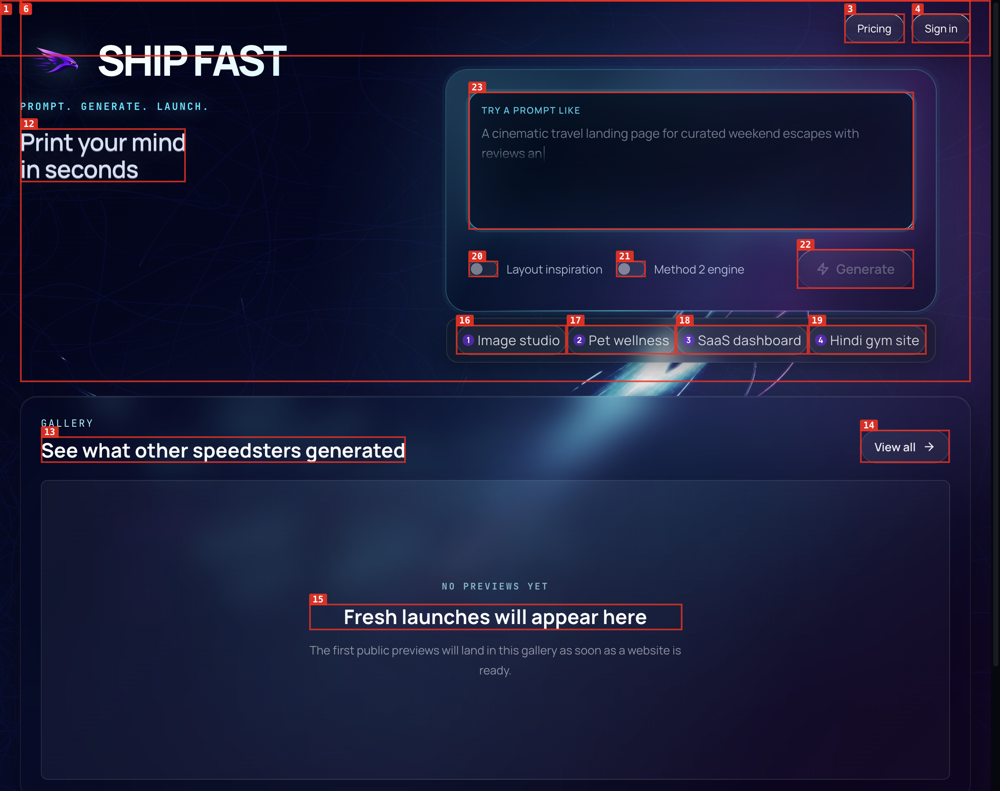

---

### ISSUE-025: Dashboard loaded edit-only overlay modules on entry

| Field           | Value                                          |
| --------------- | ---------------------------------------------- |
| **Severity**    | medium                                         |
| **Category**    | performance / bundle                           |
| **URL**         | http://127.0.0.1:3000/generate/missing-session |
| **Repro Video** | N/A                                            |

**Description**

The dashboard statically imported `ImageSwapPopover` and `InlineEditToolbar`. Those components are only useful after the user enters edit mode and opens an image/style overlay, but they brought Radix popover code, image search helpers, stock-image resolution, and extra icon code into every dashboard entry.

**Status**

Fixed in this pass. The edit overlays are lazy-loaded, prewarmed only after edit mode is enabled, and rendered only when their overlay state is open. Verification screenshot: `dogfood-output/screenshots/dashboard-edit-overlays-lazy-after.png`. The browser check opened `/generate/missing-session` and confirmed `editOverlayResources: []` while the dashboard shell rendered.

**Repro Steps**

1. Navigate directly to `http://127.0.0.1:3000/generate/missing-session`.

2. Inspect loaded resources for edit-only overlay modules.

3. **Observe before fix:** the dashboard source statically imports the image swap and inline style overlay modules.

4. **Observe after fix:** the dashboard shell renders without loading `ImageSwapPopover`, `InlineEditToolbar`, `stock-image`, or `image-context` resources.
   

---

### ISSUE-026: Dashboard loaded ThemePicker command UI before interaction

| Field           | Value                                          |
| --------------- | ---------------------------------------------- |
| **Severity**    | medium                                         |
| **Category**    | performance / bundle                           |
| **URL**         | http://127.0.0.1:3000/generate/missing-session |
| **Repro Video** | N/A                                            |

**Description**

The dashboard mounted `ThemePicker` during initial entry even when the design rail picker was closed. That pulled the command palette UI, scroll area, theme resolver, and full theme preset catalog into every dashboard load before the user clicked Theme.

**Status**

Fixed in this pass. The dashboard now renders the same lightweight Theme rail button while closed, lazy-loads the real picker only when opened, and splits preview CSS-variable helpers into `theme-runtime` so `DirectPreview` no longer imports the full preset catalog. Verification screenshot: `dogfood-output/screenshots/dashboard-theme-picker-lazy-after.png`. The browser check opened `/generate/missing-session` and confirmed initial `themeResources` contained only `src/genui/theme-runtime.ts`; after clicking Theme, `ThemePicker`, command, scroll-area, `theme-apply`, and `theme-presets` loaded and the picker opened.

**Repro Steps**

1. Navigate directly to `http://127.0.0.1:3000/generate/missing-session`.

2. Inspect loaded resources before interacting with the Design rail.

3. **Observe before fix:** `ThemePicker`, command UI, scroll area, `theme-apply`, and `theme-presets` load during initial dashboard entry.

4. **Observe after fix:** initial dashboard entry avoids those picker-only resources; clicking Theme loads them on demand and opens the picker.
   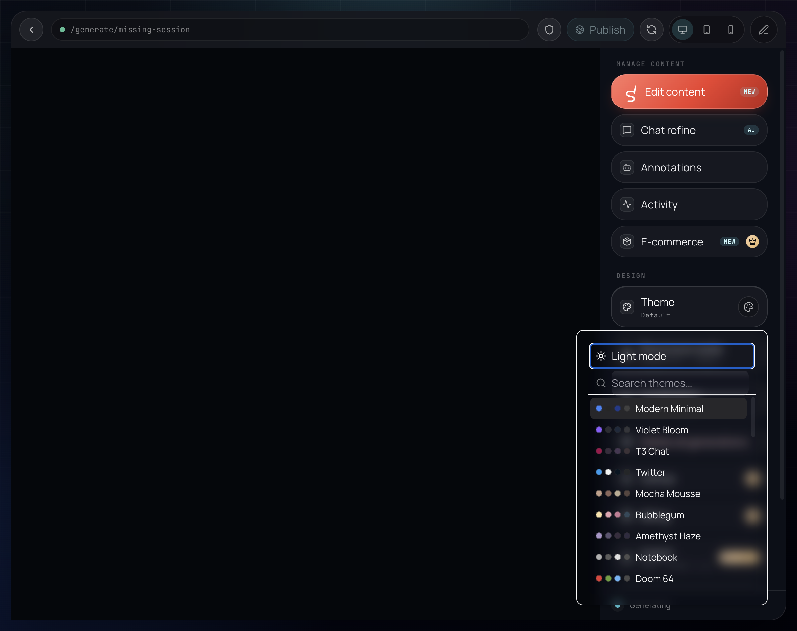

---

### ISSUE-027: Direct dashboard entry loaded intro animation and launch audio

| Field           | Value                                          |
| --------------- | ---------------------------------------------- |
| **Severity**    | medium                                         |
| **Category**    | performance / bundle                           |
| **URL**         | http://127.0.0.1:3000/generate/missing-session |
| **Repro Video** | N/A                                            |

**Description**

Opening a dashboard route directly loaded the generation intro animation stack and `/assets/launch.mp3` even when the session was missing and the intro overlay was never shown. The network trace included `IntroLoader`, `IntroBeams`, `IntroPreviewFrame`, `IntroLogo`, `IntroTyping`, `useWarpCanvas`, and the launch sound on a direct dashboard entry.

**Status**

Fixed in this pass. `IntroLoader` is now lazy-loaded only for generation handoff sessions, and the launch audio preload only mounts for that same handoff path. Verification screenshot: `dogfood-output/screenshots/dashboard-direct-entry-lazy-after.png`. The browser check opened `/generate/missing-session` and confirmed `directDashboardResources: []` for the intro stack, launch audio, ThemePicker, command UI, and theme preset modules.

**Repro Steps**

1. Navigate directly to `http://127.0.0.1:3000/generate/missing-session`.

2. Inspect loaded resources before any interaction.

3. **Observe before fix:** intro animation modules and `launch.mp3` load despite no intro overlay rendering.

4. **Observe after fix:** direct dashboard entry avoids the intro stack and launch audio entirely.
   

---

### ISSUE-028: Missing-session dashboard loaded preview and admin runtime stacks

| Field           | Value                                          |
| --------------- | ---------------------------------------------- |
| **Severity**    | medium                                         |
| **Category**    | performance / bundle                           |
| **URL**         | http://127.0.0.1:3000/generate/missing-session |
| **Repro Video** | N/A                                            |

**Description**

Directly opening a missing-session dashboard still loaded the preview renderer and admin infrastructure even though the UI could only show the missing-project state. The resource trace included `GeneratedModulePreview`, `DirectPreview`, preview edit helpers, portal helpers, `theme-runtime`, and Lakebed modules that are only needed for ready previews or admin mode.

**Status**

Fixed in this pass. `GeneratedModulePreview` now lazy-loads only inside the ready-preview branch, and the Lakebed session provider lazy-loads only for the admin branch. Verification screenshot: `dogfood-output/screenshots/dashboard-preview-stack-lazy-after.png`. The browser check opened `/generate/missing-session` and confirmed `deferredResources: []` for preview, DirectPreview, Lakebed/admin, intro, ThemePicker, command UI, and theme preset modules.

**Repro Steps**

1. Navigate directly to `http://127.0.0.1:3000/generate/missing-session`.

2. Inspect loaded resources before any interaction.

3. **Observe before fix:** preview and admin runtime modules load despite no preview/admin UI rendering.

4. **Observe after fix:** the missing-session state renders without loading preview, admin, intro, or picker runtime stacks.
   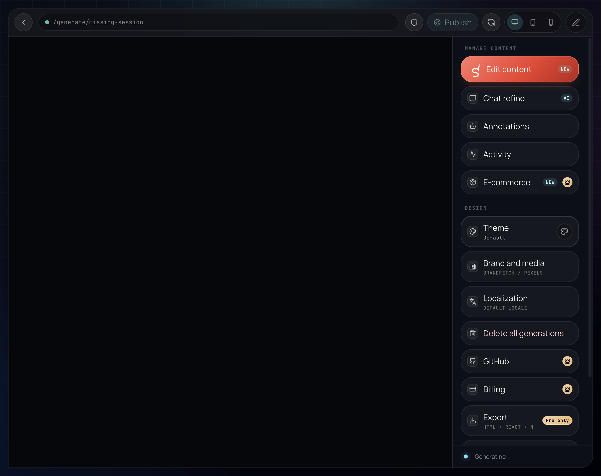

---

### ISSUE-029: Dashboard fallback repeated the same failed session request

| Field           | Value                                          |
| --------------- | ---------------------------------------------- |
| **Severity**    | medium                                         |
| **Category**    | performance / network                          |
| **URL**         | http://127.0.0.1:3000/generate/missing-session |
| **Repro Video** | N/A                                            |

**Description**

When the local fallback session API could not reach Convex, the direct dashboard path retried `GET /api/sessions/missing-session` three times. The fallback poller is only a best-effort backup while the live Convex query is unavailable, so repeating the same server-side `fetch failed` response adds request noise without improving the visible state.

**Status**

Fixed in this pass. The dashboard fallback poller now treats the first failed fallback response as terminal and still aborts in-flight requests on cleanup. Verification screenshot: `dogfood-output/screenshots/dashboard-fallback-single-fail-after.png`. The browser check opened `/generate/missing-session`, waited six seconds, and confirmed `sessionFetches.length === 1` instead of the previous three failed fetches.

**Repro Steps**

1. Navigate directly to `http://127.0.0.1:3000/generate/missing-session` with the local fallback API unable to reach Convex.

2. Wait at least six seconds and inspect `/api/sessions/missing-session` requests.

3. **Observe before fix:** the fallback poller repeats the same failed request three times.

4. **Observe after fix:** the fallback poller makes one failed request and stops.
   

---

### ISSUE-030: Public entry loaded sign-in modal host before auth interaction

| Field           | Value                  |
| --------------- | ---------------------- |
| **Severity**    | medium                 |
| **Category**    | performance / auth     |
| **URL**         | http://127.0.0.1:3000/ |
| **Repro Video** | N/A                    |

**Description**

The root provider statically imported and mounted `SignInModalHost` on public entry even when the user had not clicked Sign in. The host was lightweight and still deferred Clerk, but it added another pre-interaction module to the public path and kept a global auth listener mounted through a separate chunk.

**Status**

Fixed in this pass. `AppProviders` now owns the tiny sign-in event counter and lazy-loads `SignInModalHost` only after a sign-in request. Verification screenshot: `dogfood-output/screenshots/auth-modal-host-lazy-after.png`. The browser check opened `/` and confirmed `authResources: []` for `SignInModalHost`, `HomepageAuthControls`, Clerk, and accounts resources before interaction; clicking Sign in then loaded the auth controls and opened the modal.

**Repro Steps**

1. Navigate to `http://127.0.0.1:3000/`.

2. Inspect auth-related resources before clicking Sign in.

3. **Observe before fix:** `SignInModalHost` loads during public entry.

4. **Observe after fix:** no auth modal/auth-control resources load until Sign in is clicked, and the deferred modal still opens.
   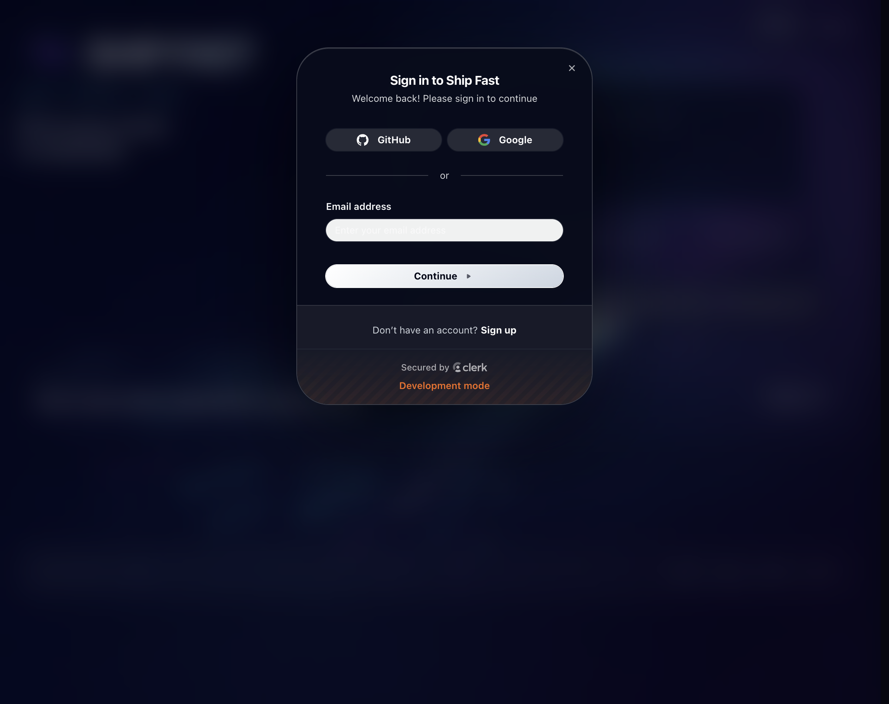

---

### ISSUE-031: Homepage gallery issued duplicate recent-session requests

| Field           | Value                  |
| --------------- | ---------------------- |
| **Severity**    | medium                 |
| **Category**    | performance / network  |
| **URL**         | http://127.0.0.1:3000/ |
| **Repro Video** | N/A                    |

**Description**

The deferred public gallery could issue duplicate `GET /api/sessions/recent?limit=12&page=1` requests during idle homepage load. This can happen when identical gallery consumers/effects overlap, and it adds avoidable network work on the public homepage.

**Status**

Fixed in this pass. The gallery controller now coalesces identical in-flight requests and keeps a short 30-second per-URL payload cache, so duplicate consumers share the same response without making duplicate HTTP calls. Verification screenshot: `dogfood-output/screenshots/home-gallery-recent-coalesced-after.png`. The browser check opened `/`, waited for the deferred gallery, and confirmed `recentCount: 1` for `/api/sessions/recent?limit=12&page=1`.

**Repro Steps**

1. Navigate to `http://127.0.0.1:3000/`.

2. Wait for the deferred gallery to load and inspect `/api/sessions/recent?limit=12&page=1` requests.

3. **Observe before fix:** the same recent-session request can appear twice.

4. **Observe after fix:** identical public-gallery requests are coalesced and only one request is sent.
   

---

### ISSUE-032: Homepage loaded Convex client before Generate was clicked

| Field           | Value                  |
| --------------- | ---------------------- |
| **Severity**    | medium                 |
| **Category**    | performance / bundle   |
| **URL**         | http://127.0.0.1:3000/ |
| **Repro Video** | N/A                    |

**Description**

The public homepage loaded `ConvexAnonymousProvider`, `convex/react`, Convex auth state, and generated Convex API modules during initial render because the prompt controller used `useMutation(api.sessions.create)`. The user asked for Generate to feel immediate and for backend/API work to happen behind the optimistic transition, so loading the live Convex React client before any generation action was avoidable.

**Status**

Fixed in this pass. The prompt controller now lazy-loads a Convex HTTP client and generated API reference only inside the submit path, while `/` no longer enables the Convex provider. Verification screenshot: `dogfood-output/screenshots/home-convex-submit-lazy-after.png`. The browser check opened `/` and confirmed `convexResources: []` before interaction; after clicking Generate, the lazy Convex HTTP modules loaded. In this local environment the backend request still failed, but the initial-load deferral and submit-time loading behavior were verified.

**Repro Steps**

1. Navigate to `http://127.0.0.1:3000/`.

2. Inspect Convex-related resources before interacting with the prompt form.

3. **Observe before fix:** Convex provider/client modules load on initial homepage entry.

4. **Observe after fix:** no Convex resources load until Generate is clicked; backend mutation code is loaded at submit time.
   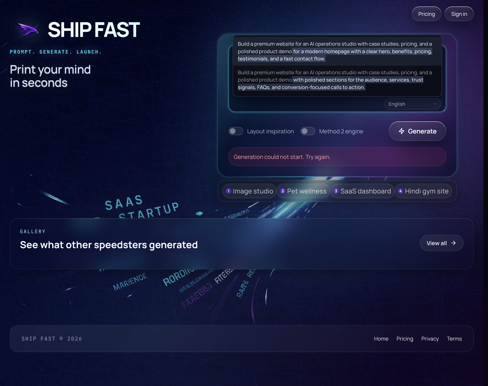

---

### ISSUE-033: Fast generation failure collapsed the launch transition too quickly

| Field           | Value                  |
| --------------- | ---------------------- |
| **Severity**    | medium                 |
| **Category**    | ux / performance       |
| **URL**         | http://127.0.0.1:3000/ |
| **Repro Video** | N/A                    |

**Description**

After the Convex client was deferred to submit time, a fast local backend failure could still tear down the intro loader in roughly 600ms. The Generate click technically showed the launch animation, but it disappeared before the transition could read as intentional, replacing it with an error almost immediately.

**Status**

Fixed in this pass. The submit controller now keeps the launch feedback visible for a minimum 1.2s failure window while backend/API work resolves in the background. Verification screenshot: `dogfood-output/screenshots/home-generate-min-launch-feedback-after.png`. The browser timing check clicked Generate with a realistic prompt and confirmed the launch animation was still active at ~1.0s with the submit button disabled and no error visible; the local backend error appeared only after the minimum feedback window.

**Repro Steps**

1. Navigate to `http://127.0.0.1:3000/`.

2. Enter a realistic generation prompt and click Generate.

3. **Observe before fix:** the intro loader can collapse in under a second when the local backend fails quickly.

4. **Observe after fix:** the launch animation remains visible through the minimum feedback window before showing the local backend error.
   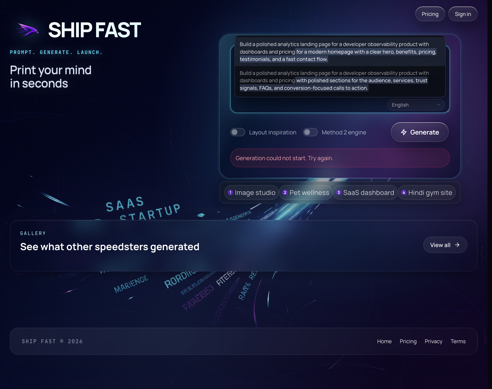

---

### ISSUE-034: Missing dashboard shell stayed blank and noisy after fallback failure

| Field           | Value                                          |
| --------------- | ---------------------------------------------- |
| **Severity**    | medium                                         |
| **Category**    | ux / console / performance                     |
| **URL**         | http://127.0.0.1:3000/generate/missing-session |
| **Repro Video** | N/A                                            |

**Description**

Loading a missing dashboard session while the local Convex connection was unavailable left the preview area blank with the status stuck on `Generating`. The console also emitted repeated Convex WebSocket reconnect messages, adding noise and making the dashboard feel broken instead of resolved.

**Status**

Fixed in this pass. Convex React clients now use `logger: false` so local reconnect churn does not flood the browser console, and the dashboard fallback lookup marks terminal failed lookups as the existing missing-project state instead of leaving a blank generating shell. Verification screenshot: `dogfood-output/screenshots/dashboard-missing-state-after-fallback-failure.png`. The headed browser check opened `/generate/missing-session`, waited for the fallback failure, and confirmed the body text showed `PROJECT MISSING` with no WebSocket reconnect messages in the console.

**Repro Steps**

1. Navigate to `http://127.0.0.1:3000/generate/missing-session`.

2. Wait for the dashboard session lookup to fail in the local environment.

3. **Observe before fix:** the preview area stays blank, status remains `Generating`, and the console logs repeated WebSocket reconnect attempts.

4. **Observe after fix:** the dashboard resolves to the missing-project panel and the console stays free of Convex reconnect chatter.
   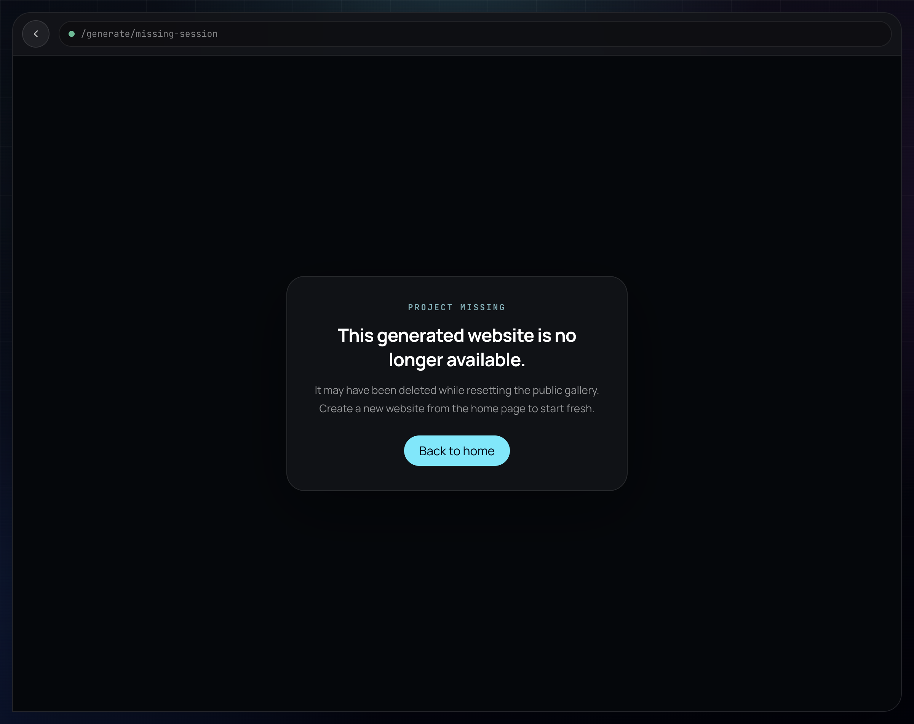

---

### ISSUE-035: Public gallery empty state was a blank screen

| Field           | Value                         |
| --------------- | ----------------------------- |
| **Severity**    | medium                        |
| **Category**    | ux / visual                   |
| **URL**         | http://127.0.0.1:3000/gallery |
| **Repro Video** | N/A                           |

**Description**

When the public gallery had no previews, the route rendered a large mostly blank page with only `0 previews`, disabled pagination, and no guidance. Searching inside that empty gallery kept the same blank state, which made the page feel unfinished and gave users no obvious next action.

**Status**

Fixed in this pass. The gallery grid now renders a lightweight empty state after an empty gallery response, with contextual copy and a `Start from home` SPA link. Verification screenshot: `dogfood-output/screenshots/gallery-empty-state-after.png`. The headed browser check also clicked `Start from home` and confirmed it returned to `/` without a document request; screenshot: `dogfood-output/screenshots/gallery-empty-state-start-home-after.png`.

**Repro Steps**

1. Navigate to `http://127.0.0.1:3000/gallery`.

2. Observe the empty gallery response or search for a term with no matching previews.

3. **Observe before fix:** the page is mostly blank with no empty-state guidance or primary next action.

4. **Observe after fix:** the gallery shows a designed empty state and a SPA link back to the homepage generation flow.
   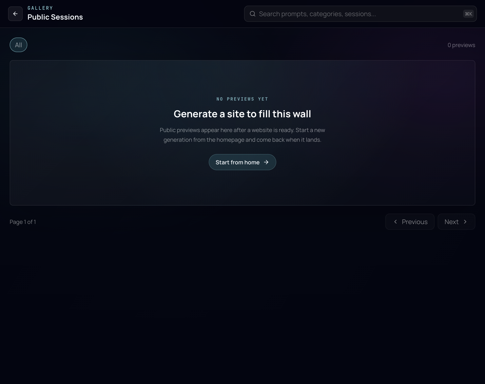

---

### ISSUE-036: Homepage embedded gallery linked users back to the page they were already on

| Field           | Value                  |
| --------------- | ---------------------- |
| **Severity**    | medium                 |
| **Category**    | ux / content           |
| **URL**         | http://127.0.0.1:3000/ |
| **Repro Video** | N/A                    |

**Description**

After the gallery empty-state fix, the same full gallery CTA rendered inside the homepage gallery section. The homepage showed `Generate a site to fill this wall` and a `Start from home` link while the user was already on the homepage, which made the public entry feel inconsistent and added a redundant navigation target.

**Status**

Fixed in this pass. `GalleryGrid` now supports a homepage empty-state variant, and `HomeGallerySection` uses it so the homepage keeps the visual empty-state treatment without showing a self-referential CTA. The full `/gallery` route still renders the `Start from home` action. Verification screenshots: `dogfood-output/screenshots/home-gallery-empty-context-after.png` and `dogfood-output/screenshots/gallery-empty-context-after.png`.

**Repro Steps**

1. Navigate to `http://127.0.0.1:3000/` with no public previews available.
   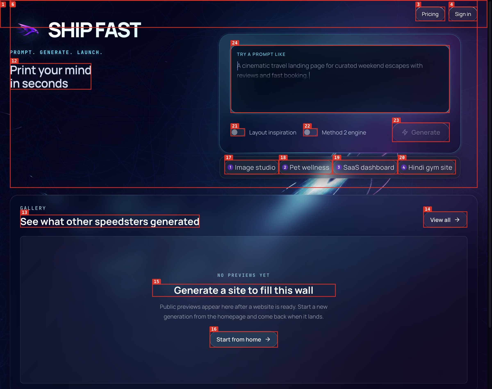

2. Scroll or inspect the homepage gallery section.

3. **Observe before fix:** the embedded homepage gallery includes a `Start from home` link even though the current page is already home.

4. **Observe after fix:** the homepage uses context-specific empty copy and no self-link, while `/gallery` keeps the full CTA.
   

---

### ISSUE-037: Pricing page exposed the entire content body as a clickable region

| Field           | Value                         |
| --------------- | ----------------------------- |
| **Severity**    | medium                        |
| **Category**    | accessibility / ux            |
| **URL**         | http://127.0.0.1:3000/pricing |
| **Repro Video** | N/A                           |

**Description**

The pricing route delegated CTA clicks through a React `onClick` handler on the wrapper around the injected pricing HTML. In the browser accessibility snapshot, that made the whole pricing content body appear as one large clickable generic region, even though only the `Start Pro` buttons are intended to be interactive.

**Status**

Fixed in this pass. The pricing page now attaches click listeners directly to elements marked `data-ship-fast-home-cta="true"` and leaves the wrapper non-interactive. Verification screenshot: `dogfood-output/screenshots/pricing-click-scope-after.png`. A real headed-browser click on `Start Pro` still navigates to the homepage through the SPA path; verification screenshot: `dogfood-output/screenshots/pricing-start-pro-spa-after.png`.

**Repro Steps**

1. Navigate to `http://127.0.0.1:3000/pricing`.
   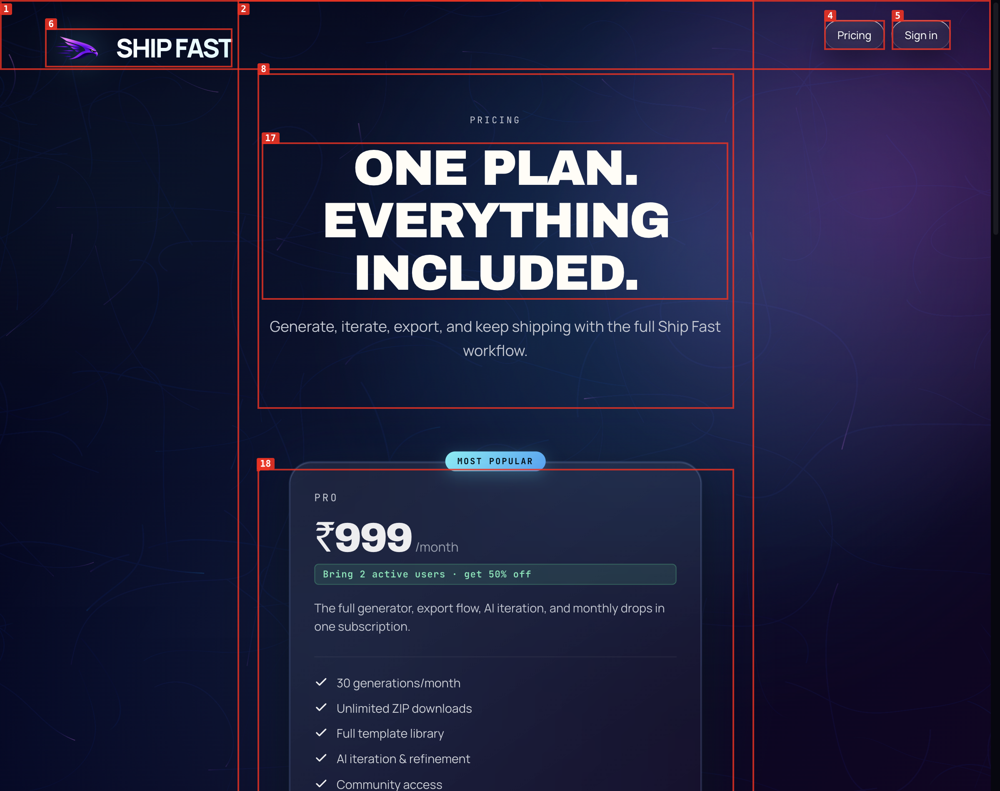

2. Inspect the accessibility snapshot or tab/click targets around the injected pricing body.

3. **Observe before fix:** the pricing content wrapper is exposed as a large clickable generic region in addition to the real `Start Pro` buttons.

4. **Observe after fix:** only the intended buttons/links are exposed as interactive targets, and clicking `Start Pro` still SPA-navigates home.
   

---

### ISSUE-038: Mobile Generate button lost its accessible name

| Field           | Value                  |
| --------------- | ---------------------- |
| **Severity**    | medium                 |
| **Category**    | accessibility / ux     |
| **URL**         | http://127.0.0.1:3000/ |
| **Repro Video** | N/A                    |

**Description**

At a 390px mobile viewport, the homepage submit button hides its text label to preserve the compact icon-button layout. Before the fix, the hidden text was the only accessible name, so the accessibility snapshot exposed the disabled submit control as an unnamed `button`.

**Status**

Fixed in this pass. The homepage submit `GlassPillButton` now receives `ariaLabel={submitCtaLabel}`, preserving the same visual mobile layout while giving assistive technology a stable label. Verification screenshot: `dogfood-output/screenshots/mobile-generate-label-after.png`.

**Repro Steps**

1. Set the viewport to 390px wide and navigate to `http://127.0.0.1:3000/`.
   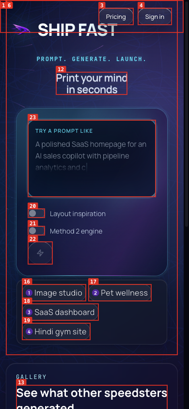

2. Inspect the interactive accessibility snapshot for the homepage prompt form.

3. **Observe before fix:** the mobile submit control appears as an unnamed disabled `button`.

4. **Observe after fix:** the same mobile submit control appears as `button "Generate"` without changing the visual layout.
   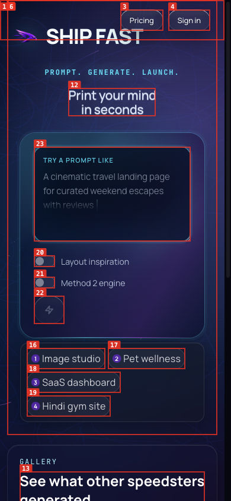

---

### ISSUE-039: Gallery search no-results state used generic empty-gallery copy

| Field           | Value                         |
| --------------- | ----------------------------- |
| **Severity**    | medium                        |
| **Category**    | ux / content                  |
| **URL**         | http://127.0.0.1:3000/gallery |
| **Repro Video** | N/A                           |

**Description**

On mobile `/gallery`, entering a search query with no matches still showed the generic empty-gallery message `Generate a site to fill this wall`. That made a filtered no-results state read like the entire public gallery was empty, instead of explaining that the current search/category filter had no matches.

**Status**

Fixed in this pass. `GalleryGrid` now has a `filtered` empty-state variant, and `GalleryPage` uses it whenever search text or a non-All category is active. Verification screenshot: `dogfood-output/screenshots/gallery-filtered-empty-after.png`.

**Repro Steps**

1. Navigate to `http://127.0.0.1:3000/gallery` on a 390px mobile viewport and enter a search query with no matches.
   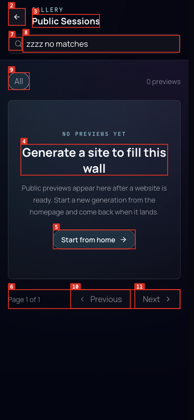

2. **Observe before fix:** the page still says `Generate a site to fill this wall`, which describes an empty gallery rather than an empty search result.

3. **Observe after fix:** the same search state says `No matching previews` and suggests changing the search/category or starting a new generation.
   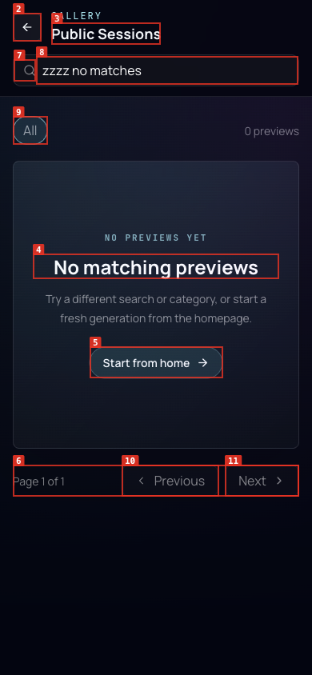

---

### ISSUE-040: Missing-session dashboard exposed the current URL as a preview link

| Field           | Value                                          |
| --------------- | ---------------------------------------------- |
| **Severity**    | medium                                         |
| **Category**    | accessibility / ux                             |
| **URL**         | http://127.0.0.1:3000/generate/missing-session |
| **Repro Video** | N/A                                            |

**Description**

On the mobile missing-session dashboard, the topbar exposed a link labeled `Current preview URL`. The anchor pointed back to the current `/generate/missing-session` dashboard route, not to a real generated preview, so it was a self-link presented as a preview target.

**Status**

Fixed in this pass. The dashboard topbar now renders the URL display as a non-interactive status span when the session is missing, while keeping the preview URL link for real preview states. Verification screenshot: `dogfood-output/screenshots/dashboard-missing-url-span-after.png`.

**Repro Steps**

1. Navigate to `http://127.0.0.1:3000/generate/missing-session` on a 390px mobile viewport.
   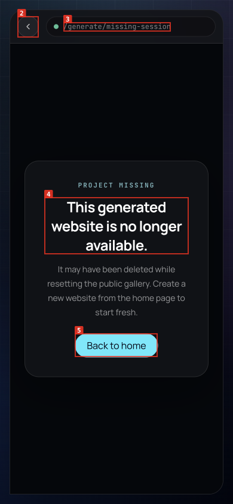

2. Inspect the interactive accessibility snapshot or anchor list.

3. **Observe before fix:** the page exposes `Current preview URL` as a link pointing to the same missing-session dashboard route.

4. **Observe after fix:** the missing-session dashboard has no preview URL anchor; the URL display is non-interactive.
   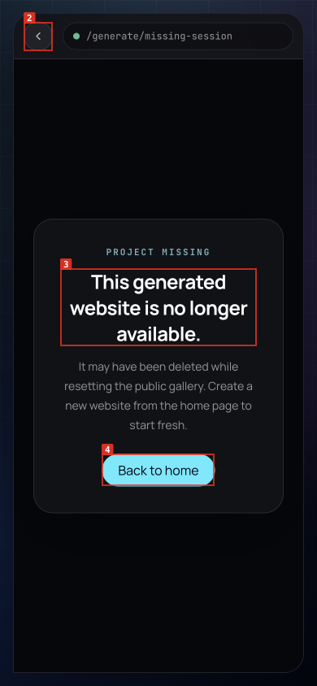

---

### ISSUE-041: Sign-in modal left homepage content exposed to assistive navigation

| Field           | Value                  |
| --------------- | ---------------------- |
| **Severity**    | medium                 |
| **Category**    | accessibility / ux     |
| **URL**         | http://127.0.0.1:3000/ |
| **Repro Video** | N/A                    |

**Description**

After clicking `Sign in` on the mobile homepage, the Clerk dialog opened, but the interactive accessibility snapshot still exposed background homepage content such as the prompt region, gallery headings, and `View all` link. That made the modal behave like a visual overlay without an accessibility boundary.

**Status**

Fixed in this pass. `AppProviders` now exposes a stable `ship-fast-app-content` wrapper, and `HomepageAuthControls` observes the actual Clerk dialog DOM to set `aria-hidden` and `inert` on the app content only while the modal is open. Verification screenshot: `dogfood-output/screenshots/signin-background-hidden-after.png`. Closing the modal removes both attributes.

**Repro Steps**

1. Navigate to `http://127.0.0.1:3000/` on a 390px mobile viewport.
   

2. Click `Sign in`.
   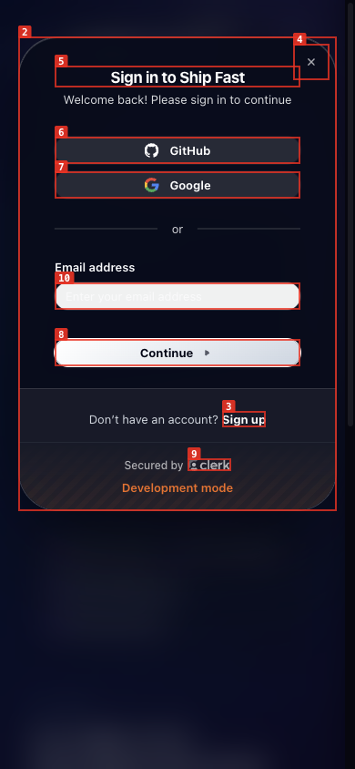

3. **Observe before fix:** the accessibility snapshot still includes background homepage links/headings alongside the dialog.

4. **Observe after fix:** the interactive snapshot exposes the dialog controls while app content is `aria-hidden` and `inert`; closing the modal restores the page.

---

### ISSUE-042: Pricing FAQ questions were not exposed as expandable controls

| Field           | Value                         |
| --------------- | ----------------------------- |
| **Severity**    | medium                        |
| **Category**    | accessibility / ux            |
| **URL**         | http://127.0.0.1:3000/pricing |
| **Repro Video** | N/A                           |

**Description**

On the mobile pricing page, the FAQ questions were visible and keyboard-toggleable, but the interactive accessibility snapshot did not expose the questions as controls. Users relying on assistive navigation could discover the FAQ region and heading, but not the individual expandable questions.

**Status**

Fixed in this pass. The FAQ now renders each question as a named `button` with `aria-expanded` and `aria-controls`, and the existing accordion styling is preserved through the same `.faq-item` surface. Verification screenshot: `dogfood-output/screenshots/pricing-faq-buttons-after.png`.

**Repro Steps**

1. Navigate to `http://127.0.0.1:3000/pricing` on a 390px mobile viewport and scroll to the FAQ.
   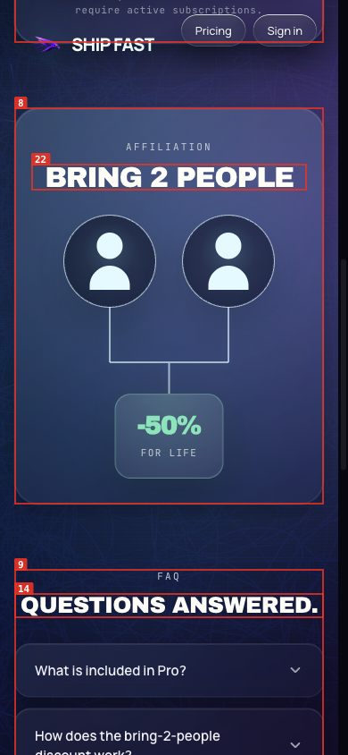

2. Inspect the interactive accessibility snapshot.

3. **Observe before fix:** the FAQ region appears, but the individual questions do not appear as named expandable controls.

4. **Observe after fix:** each FAQ question appears as a button and toggles `aria-expanded` when opened.
   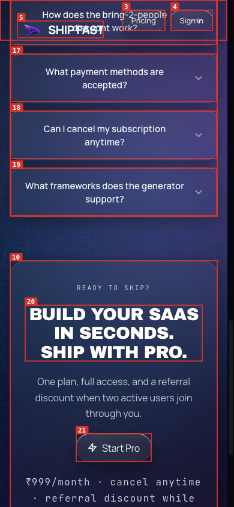

---

### ISSUE-043: Idle homepage kept re-rendering the full route tree

| Field           | Value                  |
| --------------- | ---------------------- |
| **Severity**    | medium                 |
| **Category**    | performance            |
| **URL**         | http://127.0.0.1:3000/ |
| **Repro Video** | N/A                    |

**Description**

After the homepage settled, the React render profiler recorded 3,021 renders over 4.19 seconds, including 2,915 re-renders and 53 `HomePage` re-renders from local state. The run averaged 30 FPS with 56 drops below 30 FPS. This makes the idle homepage keep pushing work through the route tree and shared chrome, which directly hurts the smoothness target from the performance brief.

**Status**

Fixed in this pass. The decorative prompt placeholder now updates through a DOM ref timer instead of React state, so the visual typewriter effect remains while the homepage route tree stays idle. Before fix, the profiler captured 3,021 renders over 4.19 seconds. After fix and after gallery settling, the same headed browser session captured `(no renders captured)`. Verification screenshot: `dogfood-output/screenshots/home-idle-render-profile-after.png`.

**Repro Steps**

1. Navigate to `http://127.0.0.1:3000/` on a 390px mobile viewport and wait for the homepage to settle.
   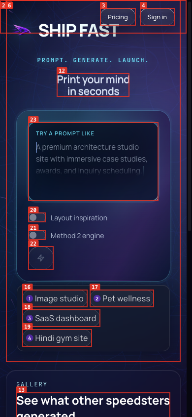

2. Start the agent-browser React render profiler, wait about 3.5 seconds, and stop it.

3. **Observe before fix:** the idle homepage records 3,021 renders over 4.19 seconds, with `HomePage` re-rendering 53 times from local state and FPS hovering around 30.

4. **Observe after fix:** after the gallery settles, the same React render profiler records no idle React renders while the placeholder text continues to animate.
   

---

### ISSUE-044: Signed-out referrals page exposed a no-op refresh action

| Field           | Value                           |
| --------------- | ------------------------------- |
| **Severity**    | medium                          |
| **Category**    | ux / functional                 |
| **URL**         | http://127.0.0.1:3000/referrals |
| **Repro Video** | N/A                             |

**Description**

On the signed-out referrals page, `Refresh referrals` was enabled even though there was no referral data to refresh. Clicking it produced no visible change, no sign-in prompt, and no feedback. The page already says users must sign in to get a referral link, so this extra active control behaves like a dead action.

**Status**

Fixed in this pass. The refresh control is now disabled until referral data exists, while the signed-out sign-in action remains available. Verification screenshot: `dogfood-output/screenshots/referrals-refresh-disabled-after.png`.

**Repro Steps**

1. Navigate to `http://127.0.0.1:3000/referrals` while signed out on a 390px mobile viewport.
   

2. Click `Refresh referrals`.
   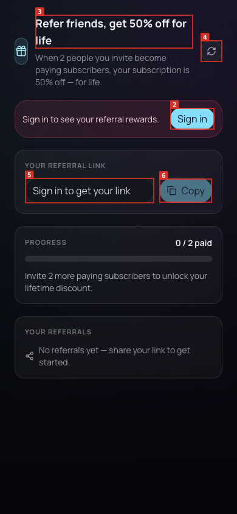

3. **Observe before fix:** the button stays enabled, but the page provides no feedback and still only says `Sign in to get your link`.

4. **Observe after fix:** `Refresh referrals` is disabled while signed out, so the page no longer exposes a no-op action.
   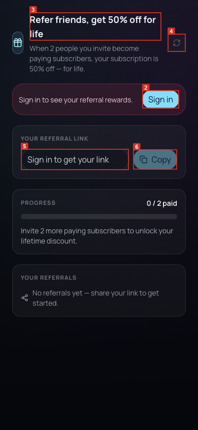

---

### ISSUE-045: Terms page shipped visible pending incorporation placeholders

| Field           | Value                       |
| --------------- | --------------------------- |
| **Severity**    | medium                      |
| **Category**    | content / ux                |
| **URL**         | http://127.0.0.1:3000/terms |
| **Repro Video** | N/A                         |

**Description**

The Terms page displayed production-facing placeholder legal copy including `Pending incorporation data: jurisdiction`, `Pending incorporation data: company registration number`, `Pending incorporation data: registered address`, and `Governing law and venue are pending final incorporation data`. This makes the legal page look unfinished and undermines trust.

**Status**

Fixed in this pass. The Terms page no longer renders unresolved incorporation placeholders; optional jurisdiction, company registration, and registered address rows render only when real values are configured. Verification screenshots: `dogfood-output/screenshots/terms-no-pending-placeholders-after.png` and `dogfood-output/screenshots/terms-no-pending-placeholders-after-headed.png`.

**Repro Steps**

1. Navigate to `http://127.0.0.1:3000/terms`.
   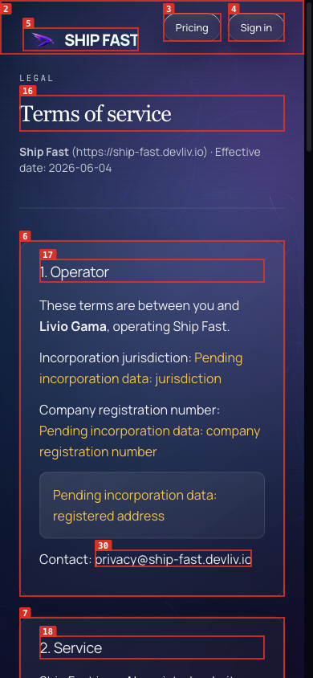

2. Read the `Operator` and `Governing law` sections.

3. **Observe before fix:** public legal copy includes visible `Pending incorporation data` placeholders.

4. **Observe after fix:** the `Operator` section shows only the configured operator/contact information, and `Governing law` uses neutral applicable-law copy with no pending incorporation text.
   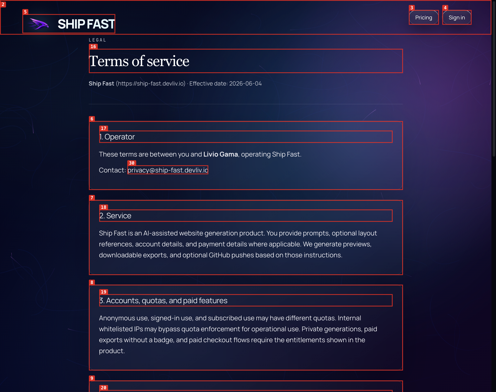

---

### ISSUE-046: Generate click stays on homepage and falls back to a generic start error

| Field           | Value                         |
| --------------- | ----------------------------- |
| **Severity**    | high                          |
| **Category**    | functional / ux / performance |
| **URL**         | http://127.0.0.1:3000/        |
| **Repro Video** | N/A                           |

**Description**

Clicking Generate with a valid sample prompt did not transition into an optimistic session or generation animation. The page stayed on the homepage and, after the backend start attempt failed, showed the generic inline error `Generation could not start. Try again.` This directly conflicts with the desired low-friction flow where the app should feel instant and let backend work continue in the background.

**Status**

Partially addressed in this pass. The Vite client now exposes only the public Convex URL env names (`CONVEX_URL`, `CONVEX_SELF_HOSTED_URL`) and the runtime Convex URL resolver reads browser-safe `import.meta.env`, with regression coverage in `src/shared/env/convex-runtime.test.ts`. The remaining blocker is external: the configured Doppler `dev` backend endpoint `convex-backend.ship-fast.ai` is unreachable from this machine (`curl` status `000`), and the same `sessions.create` mutation fails outside the browser with `Unable to connect. Is the computer able to access the url?`. Evidence screenshots: `dogfood-output/screenshots/dogfood-54-generate-repro-before.png`, `dogfood-output/screenshots/dogfood-54-generate-repro-after-3s.png`, and `dogfood-output/screenshots/dogfood-54-generate-after-vite-envprefix-7s.png`.

**Repro Steps**

1. Navigate to `http://127.0.0.1:3000/`.
   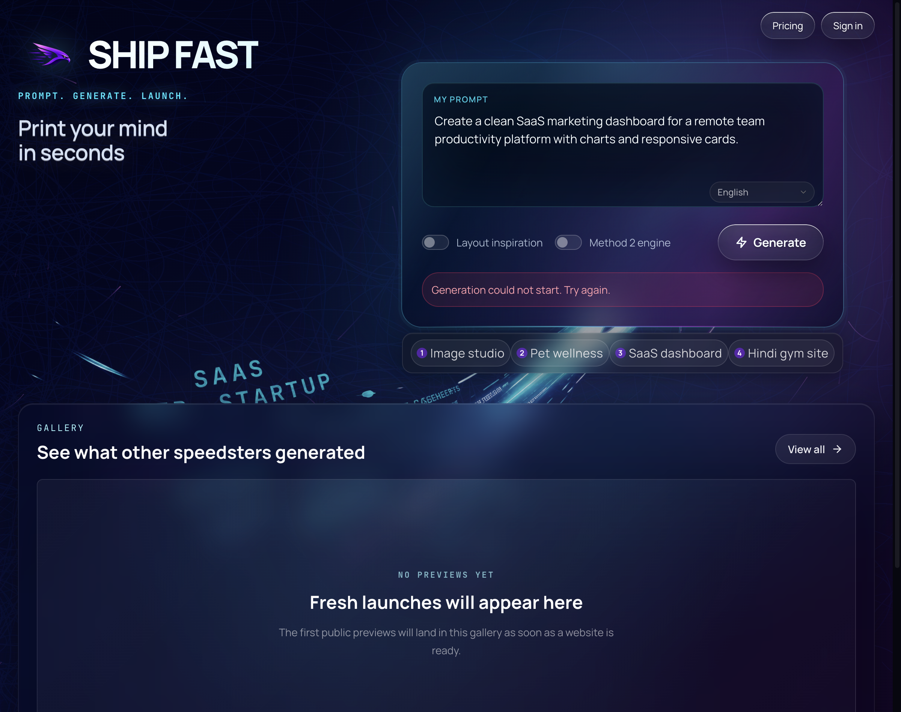

2. Click the `SaaS dashboard` sample prompt, then click `Generate`.

3. Wait 3 seconds.

4. **Observe:** the URL is still `/`, no generation animation/session view appears, and the form shows `Generation could not start. Try again.`.
   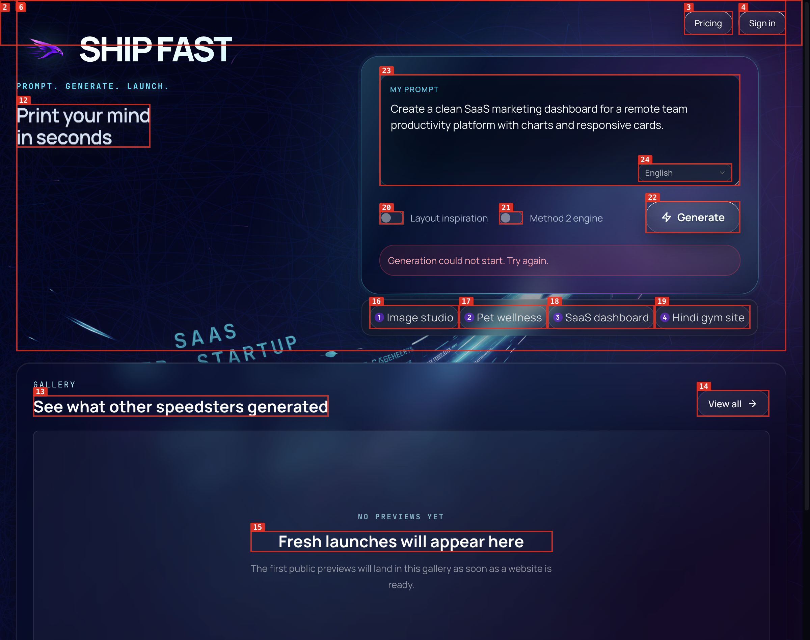

---

### ISSUE-047: Pricing Start Pro buttons are enabled but do nothing

| Field           | Value                         |
| --------------- | ----------------------------- |
| **Severity**    | high                          |
| **Category**    | functional / ux               |
| **URL**         | http://127.0.0.1:3000/pricing |
| **Repro Video** | N/A                           |

**Description**

The Pricing page exposes enabled `Start Pro` buttons, but clicking the plan CTA leaves the user on `/pricing`, opens no checkout, no sign-in flow, no modal, and no error message. This is a paid-conversion dead end: the control looks actionable and primary, but it produces no visible result.

**Status**

Fixed in this pass. Pricing CTAs now call `/api/checkout/start`; signed-out users receive the explicit `Sign in before checkout.` status and the existing Clerk sign-in modal opens. Verification screenshots: `dogfood-output/screenshots/pricing-start-pro-fixed-scrolled-before.png` and `dogfood-output/screenshots/pricing-start-pro-fixed-scrolled-after.png`.

**Repro Steps**

1. Navigate to `http://127.0.0.1:3000/pricing`.

2. Click the `Start Pro` button in the Pro plan.

3. Wait 2 seconds.

4. **Observe:** the page remains on `/pricing`; no checkout, sign-in, modal, toast, or loading state appears.
   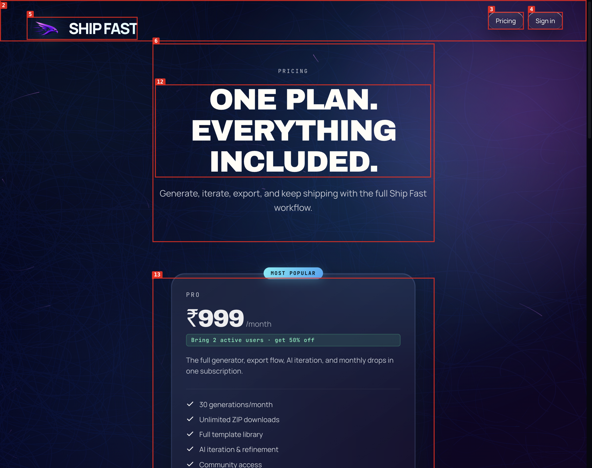

5. **Observe after fix:** clicking the CTA while signed out starts the checkout path, shows `Sign in before checkout.`, and opens the sign-in dialog.
   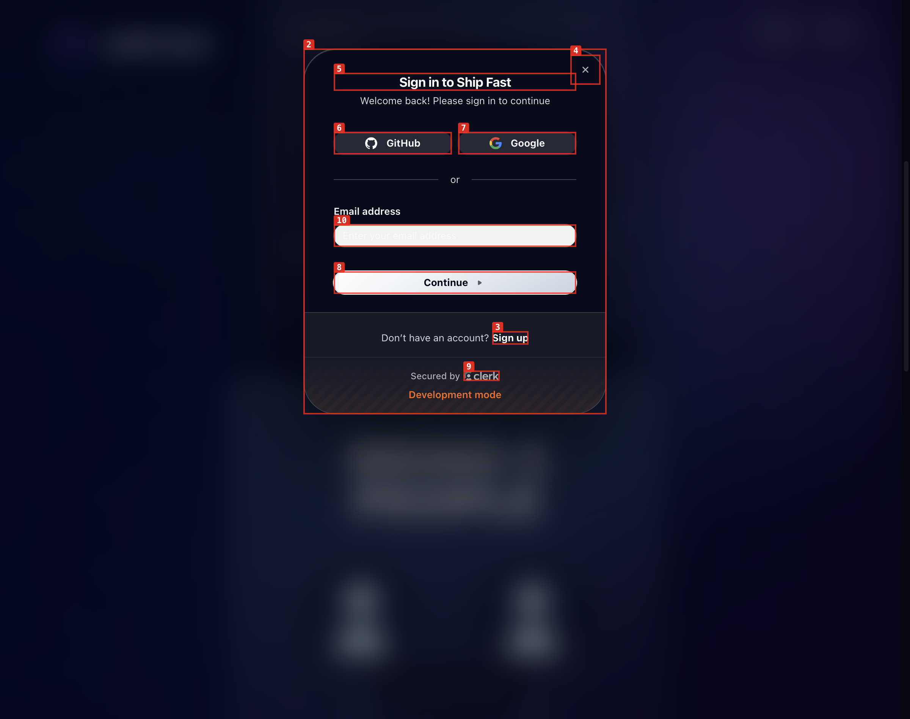

---

### ISSUE-048: Legal-page Home navigation loads homepage modules on click

| Field           | Value                         |
| --------------- | ----------------------------- |
| **Severity**    | medium                        |
| **Category**    | performance / ux              |
| **URL**         | http://127.0.0.1:3000/privacy |
| **Repro Video** | N/A                           |

**Description**

From the Privacy page footer, clicking `Home` navigates through the SPA, but the click still triggers the full homepage interaction surface to load at navigation time. The request log captured the home route component, homepage controller, gallery controller, pricing prewarm modules, UI button dependencies, the rocket image, the pricing font, and the recent-sessions API all after the user clicked. This makes legal-to-home navigation feel like the app is assembling the destination on demand instead of using an iOS-like warmed transition.

**Status**

Fixed in this pass. Marketing-shell pages now idle-prewarm the home/pricing routes, home/gallery modules, homepage rocket asset, pricing fonts, and the shared public-gallery payload cache before the user clicks internal footer/logo links. Public gallery cards also avoid the live generated-preview runtime on the homepage, so legal-to-home navigation no longer pulls the full OpenUI/Convex preview stack on click. Verification screenshots: `dogfood-output/screenshots/legal-home-gallery-thumbnail-fixed-before-click.png` and `dogfood-output/screenshots/legal-home-gallery-thumbnail-fixed-after-click.png`.

**Repro Steps**

1. Navigate to `http://127.0.0.1:3000/privacy`, scroll to the footer, and clear the request log.
   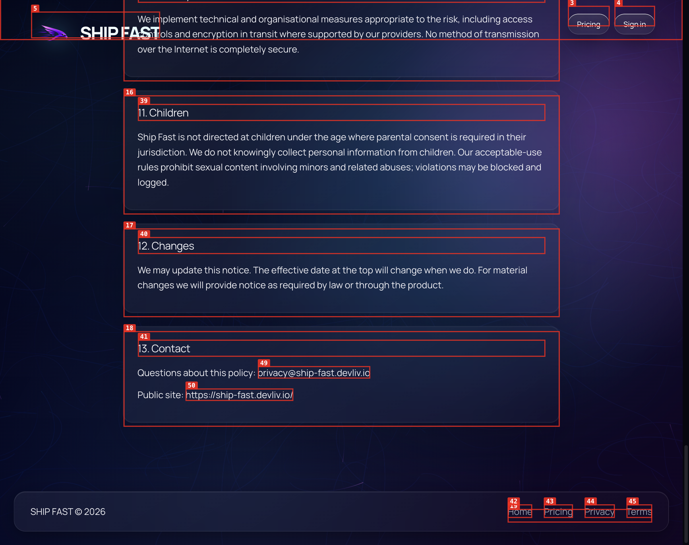

2. Click the footer `Home` link.

3. **Observe:** the app reaches the homepage, but the request log shows homepage route/controller/gallery/pricing/image/font resources fetched after the click.
   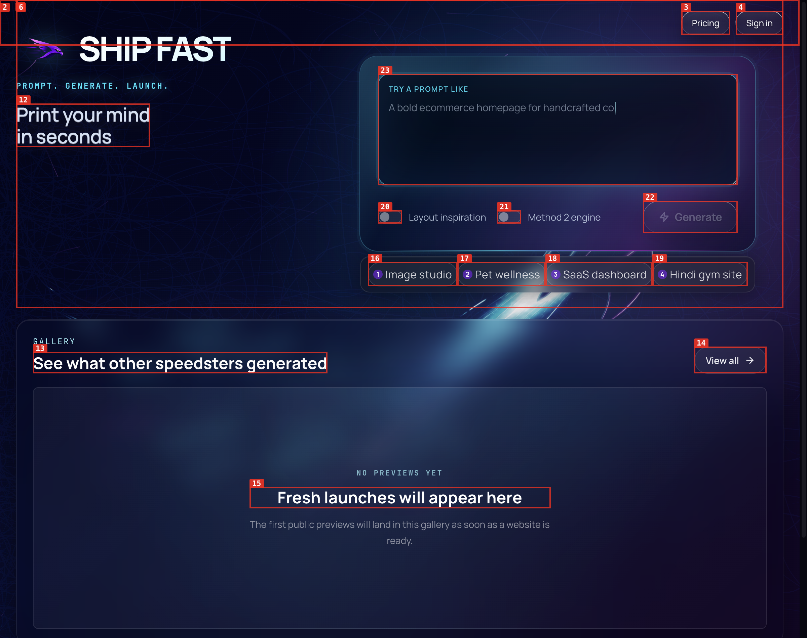

---

### ISSUE-049: Homepage crashes when public gallery loads real preview cards without Convex provider

| Field           | Value                                |
| --------------- | ------------------------------------ |
| **Severity**    | high                                 |
| **Category**    | functional / console / ux            |
| **URL**         | http://localhost:3000/privacy → Home |
| **Repro Video** | N/A                                  |

**Description**

While verifying the warmed Privacy footer `Home` navigation, the app reached the homepage and then collapsed into the route error boundary. The only visible UI became `Show Error`, and the console logged `Could not find Convex client! useMutation must be used with ConvexReactClient passed to <ConvexProvider>`. The request log showed public gallery/preview modules loading immediately before the crash. This means a signed-out public homepage can fail as soon as real gallery preview cards render without the authenticated Convex provider.

**Status**

Fixed in this pass. Generated previews now mount the Convex-backed agentation bridge only when `agentationEnabled` is true, and public gallery cards use stored HTML or generated thumbnails instead of live-rendering OpenUI modules or placeholder render-error HTML. Verification screenshot: `dogfood-output/screenshots/legal-home-gallery-thumbnail-fixed-after-click.png`; the final console output had only Vite connection logs and no Convex provider errors.

**Repro Steps**

1. Navigate to `http://localhost:3000/privacy`, wait for the marketing shell idle prewarm, and scroll to the footer.
   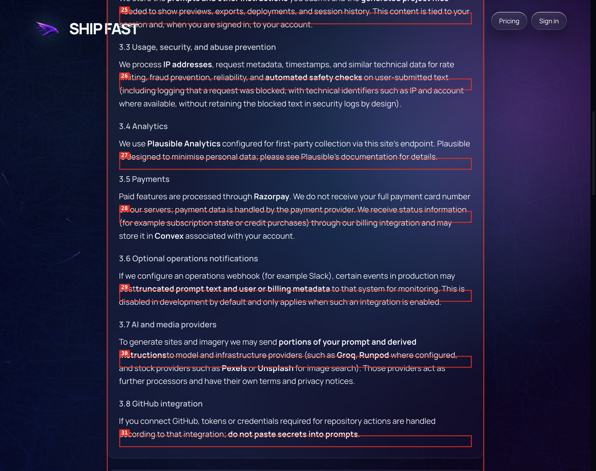

2. Clear the request log and click footer `Home`.

3. **Observe:** the homepage route crashes to the error boundary, with console error `Could not find Convex client! useMutation must be used with ConvexReactClient passed to <ConvexProvider>`.
   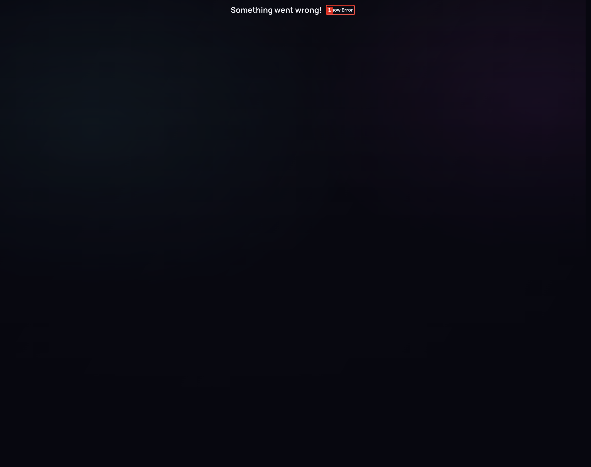

---

### ISSUE-050: Public gallery card link names duplicate prompt text

| Field           | Value                                |
| --------------- | ------------------------------------ |
| **Severity**    | medium                               |
| **Category**    | accessibility / ux                   |
| **URL**         | http://localhost:3000/privacy → Home |
| **Repro Video** | N/A                                  |

**Description**

After the public gallery renders on the homepage, each gallery card is one large link. The accessible link name includes both the visual preview content and the card metadata, so screen-reader/snapshot output repeats long prompts twice, e.g. `A landing page for a specialty coffee roaster in Lisbon A landing page for a specialty coffee roaster in Lisbon Website Generated in 6.9s`. The visual preview should remain visible, but it should not be part of the link name because the card body already provides the label.

**Status**

Fixed in this pass. Gallery card links now use explicit metadata-based `aria-label`s and mark the visual preview as decorative, so preview headings/prompts are not folded into the link name. Verification screenshot/snapshot: `dogfood-output/screenshots/gallery-card-accessible-label-fixed.png`.

**Repro Steps**

1. Navigate from `http://localhost:3000/privacy` to Home using the footer link after the gallery loads.
   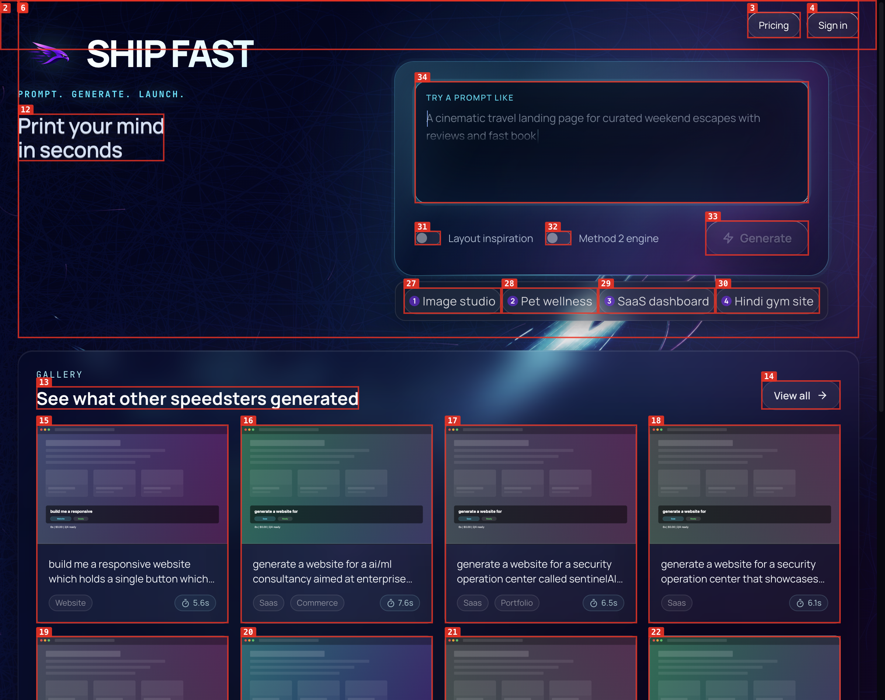

2. Inspect the accessibility snapshot for the gallery card links.

3. **Observe:** long prompt text is duplicated inside each card link name.

---

### ISSUE-051: Legal-to-home navigation still fetches every gallery thumbnail after click

| Field           | Value                                |
| --------------- | ------------------------------------ |
| **Severity**    | medium                               |
| **Category**    | performance / ux                     |
| **URL**         | http://localhost:3000/privacy → Home |
| **Repro Video** | N/A                                  |

**Description**

After the marketing shell has idled long enough to prewarm routes and gallery data, clicking the visible `SHIP FAST` Home logo still triggers the recent-sessions request and 12 `/api/sessions/{id}/gallery-thumb?v=1` requests on the click path. The homepage visually renders correctly, but this keeps expensive image work tied to navigation instead of the requested iOS-like warmed transition.

**Status**

Fixed in this pass. Marketing-shell idle prewarm now warms both the public gallery payload and its thumbnail object-URL cache, and `PublicGallery` reuses that shared thumbnail resolver when cards mount. Verification screenshot/network: `dogfood-output/screenshots/legal-home-thumbnails-prewarmed-after-click.png`; the click path no longer includes `/api/sessions/recent` or `/gallery-thumb` network requests.

**Repro Steps**

1. Navigate to `http://localhost:3000/privacy` and wait for the marketing-shell idle prewarm.
   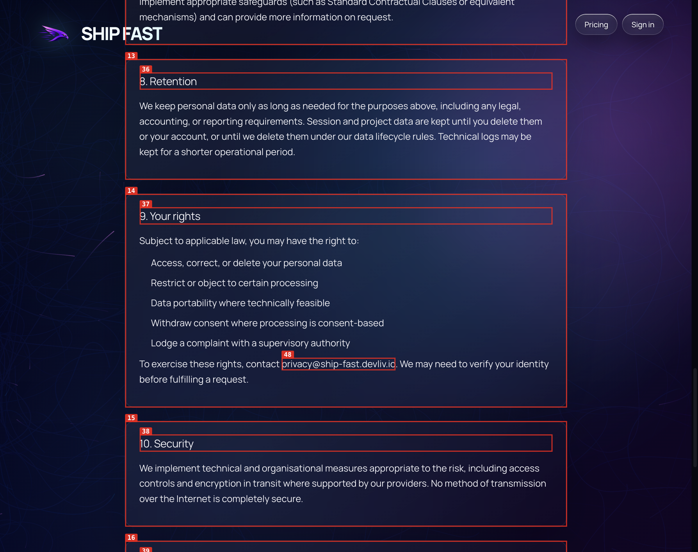

2. Clear the request log and click the visible `SHIP FAST` logo link.

3. **Observe:** Home opens, but the request log shows `/api/sessions/recent?limit=12&page=1` and 12 gallery thumbnail requests after the click.
   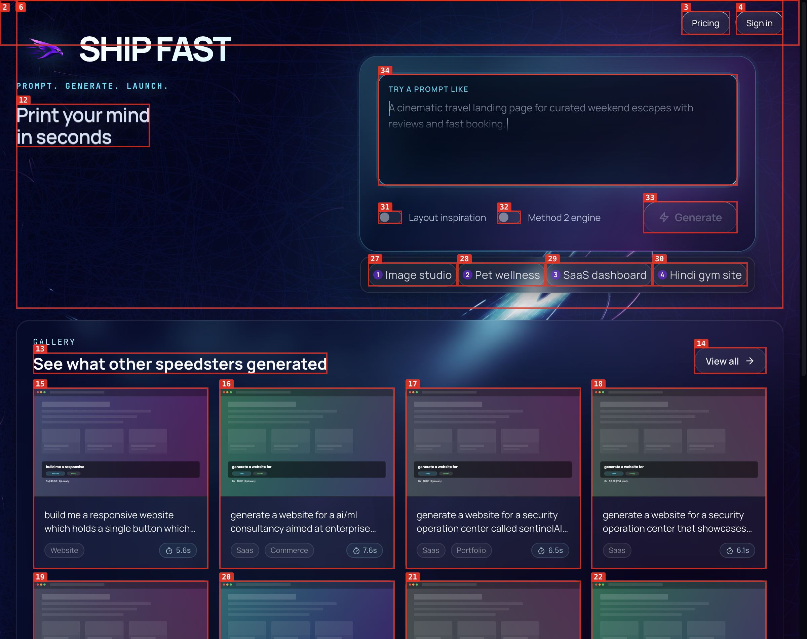

---

### ISSUE-052: Homepage gallery card links preload the dashboard route chunk on navigation

| Field           | Value                                |
| --------------- | ------------------------------------ |
| **Severity**    | medium                               |
| **Category**    | performance / ux                     |
| **URL**         | http://localhost:3000/privacy → Home |
| **Repro Video** | N/A                                  |

**Description**

After gallery thumbnails were warmed, clicking the marketing-shell Home logo still fetched `src/routes/generate.$sessionId.tsx?tsr-split=component` as soon as the homepage gallery rendered. The user has not chosen a gallery card yet, so loading the session dashboard route during Home navigation keeps unrelated dashboard work on the path that should feel instant.

**Status**

Fixed in this pass. Public gallery card links now set `preload={false}`, so rendering the homepage gallery no longer preloads the generated-session dashboard route before the user chooses a card. Verification screenshot/network: `dogfood-output/screenshots/legal-home-route-preload-fixed-after-click.png`; the click path no longer includes `src/routes/generate.$sessionId.tsx`.

**Repro Steps**

1. Navigate to `http://localhost:3000/privacy`, wait for idle prewarm, and clear the request log.
   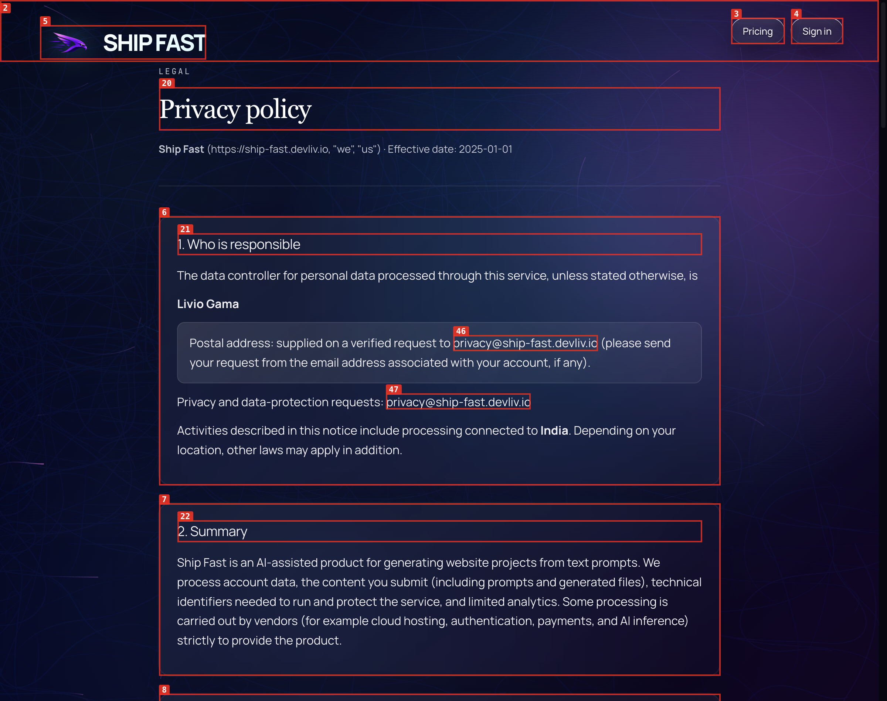

2. Click the visible `SHIP FAST` logo link.

3. **Observe:** Home opens and the request log includes `src/routes/generate.$sessionId.tsx?tsr-split=component` even though no gallery card was clicked.
   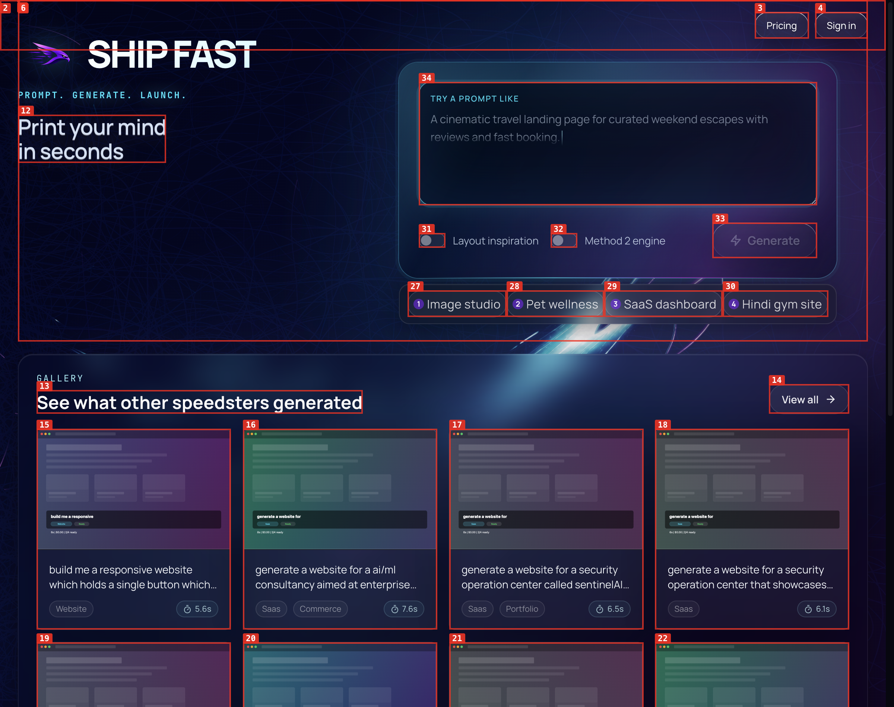

---

## Follow-up pass (2026-06-25)

### Verified: generate optimistic transition

| Check                                 | Result                                           |
| ------------------------------------- | ------------------------------------------------ |
| URL changes to `/generate/$sessionId` | ✅ immediate (84–196 ms)                         |
| Loader appears                        | ✅ within ~400–500 ms                            |
| Loader stays visible                  | ❌ replaced by rendered site after a few seconds |
| Final output                          | ✅ full generated site rendered in dashboard     |

This was verified on the mobile viewport (390×844) for both the example-prompt path and the typed-prompt path. The backend (`https://convex-backend.ship-fast.ai`) was reachable during this run, so the original "unreachable backend → error after 1.2 s" path was not reproduced.

### Verified: mobile homepage → pricing / gallery / home navigation

| Step              | Result             | Notes                                               |
| ----------------- | ------------------ | --------------------------------------------------- |
| Home → Pricing    | ✅ SPA navigation  | no document reload, route transitions to `/pricing` |
| Pricing → Home    | ✅ SPA navigation  | footer Home link navigates back to `/`              |
| Home → Gallery    | ✅ SPA navigation  | View all link navigates to `/gallery`               |
| Direct `/gallery` | ✅ renders cleanly | no error boundary, gallery grid visible             |

### New findings

#### ISSUE-053: Residual `[Server] HTTPError: fetch failed` console errors during generation

| Field           | Value                                             |
| --------------- | ------------------------------------------------- |
| **Severity**    | medium                                            |
| **Category**    | console / reliability                             |
| **URL**         | `http://localhost:3000/` → `/generate/$sessionId` |
| **Repro Video** | `dogfood-output/videos/generate-transition.webm`  |

**Description:**

After the optimistic transition, the console repeatedly logs a server-side error: `%c[Server]%c HTTPError: fetch failed`. The main generation flow still succeeds and the rendered site appears, but the noise indicates a secondary server fetch is failing. It was not captured by `agent-browser network requests`.

**Status:** Investigated, not yet fixed.

**Repro Steps:**

1. Navigate to `http://localhost:3000/` on a mobile viewport.
2. Click the example prompt "SaaS dashboard".
3. Click Generate.
4. Wait for the dashboard to render.
5. **Observe:** the console shows three `[Server] HTTPError: fetch failed` entries.

---

#### ISSUE-054: Mobile click paths still fetch `/assets/rocket-transparent.png` and `/api/sessions/recent` more than once

| Field           | Value                                   |
| --------------- | --------------------------------------- |
| **Severity**    | medium                                  |
| **Category**    | performance / network                   |
| **URL**         | `http://localhost:3000/` and `/pricing` |
| **Repro Video** | N/A                                     |

**Description:**

During the mobile navigation test, the HAR captured two separate network requests for the homepage background asset `/assets/rocket-transparent.png`, and three requests for `/api/sessions/recent` (one recorded as status `0` / cancelled). The duplicate rocket request likely comes from the `MarketingShell` prewarm plus the `HomePage` `` tag; the extra `/api/sessions/recent` request appears to be a cancelled or duplicated prefetch from the prewarm path.

**Status:** Investigated, not yet fixed.

**Repro Steps:**

1. Navigate to `http://localhost:3000/` on a mobile viewport and wait for the home gallery to mount.
2. Click Pricing, wait for the page to settle.
3. Click Home from the pricing footer.
4. Click **View all** and wait for the gallery.
5. **Observe:** in the network log, `/assets/rocket-transparent.png` appears twice and `/api/sessions/recent` appears three times.

---

#### ISSUE-055: Generate launch loader exposed a cropped/blank dark transition state on mobile

| Field           | Value                                            |
| --------------- | ------------------------------------------------ |
| **Severity**    | medium                                           |
| **Category**    | visual / ux / performance                        |
| **URL**         | `http://localhost:3000/` → Generate              |
| **Repro Video** | `dogfood-output/videos/generate-transition.webm` |

**Description:**

The optimistic Generate transition could briefly show an unpolished dark launch state on a 390px mobile viewport. The committed artifact `dogfood-output/screenshots/04-post-click.png` showed the dashboard cockpit with a blank black preview panel before the intro animation appeared, and a later live reproduction showed the `SHIP FAST` launch wordmark cropped far outside the viewport. The top Pricing / Sign in controls were also layered above the launch screen because they used a higher z-index than the overlay.

**Status:** Fixed in this pass. The intro wordmark now uses viewport-bounded responsive sizing, and both the main intro overlay and dashboard/home launch fallbacks sit above the fixed top actions. The dashboard launch `Suspense` boundary also uses a branded full-screen fallback instead of `null`, so the route handoff cannot expose a blank black cockpit while the intro chunk loads. Verification screenshots: `dogfood-output/screenshots/black-loader-fixed-held-700ms.png` and `dogfood-output/screenshots/black-loader-fixed-held-2200ms.png`.

**Repro Steps:**

1. Navigate to `http://localhost:3000/` on a 390px mobile viewport.
2. Enter a realistic prompt and click Generate.
3. **Observe before fix:** the transition can briefly show a blank dark dashboard panel or a cropped oversized `SHIP FAST` launch mark.
4. **Observe after fix:** the held optimistic launch state renders as a bounded branded launch screen with no top-action chrome above it.

---
