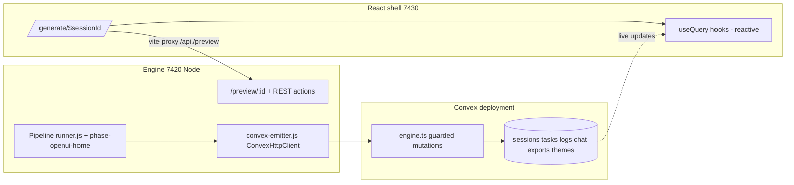

# Port Session Dashboard to React + Convex (nuke SSE)

## Current state (verified)

- `bun dev` = Express engine on **7420** (`src/index.js` → `src/server/index.js`): generation pipeline, `/preview/:id`, ~25 `/api/sessions/*` endpoints, SSE at `/api/sessions/:id/stream`, and the working vanilla page at `/session/:id` ([public/dashboard.html](public/dashboard.html) 1.9k lines + [src/scripts/dashboard-main.ts](src/scripts/dashboard-main.ts) 5.7k lines + [public/styles/dashboard.css](public/styles/dashboard.css)).
- `start:shell:dev` = Vite/TanStack Start on **7430**; [src/routes/generate.$sessionId.tsx](src/routes/generate.$sessionId.tsx) is a broken bespoke page (filesystem polling, no realtime, missing Tailwind, dead download API, Clerk env crash).
- Convex groundwork already exists: [convex/schema.ts](convex/schema.ts) has `sessions` (with `legacySessionId`), `tasks`, `chatMessages`, `exports`, `themeOverrides`, `cmsConfigs`, `previewHistory`, `agentationAnnotations`; [convex/sessions.ts](convex/sessions.ts) has `mirrorLegacySession`/`getByLegacySessionId`; engine already uses `ConvexHttpClient` for billing.
- All realtime emits funnel through one choke point: `makeSessionState().broadcast` in [src/server/sessions.js](src/server/sessions.js) (L910-913) → WS + SSE. Full event inventory mapped (tasks_loaded, task_updated, status, log, homepage_ready, openui_ready, openui_stream_*, preview_reload, run_completed, deployed, export_ready, theme_override_updated, error, clone events).

## Target architecture

Boundary: all **UI-visible state is read reactively from Convex** (`useQuery`). The Node engine keeps doing filesystem/LLM work but **writes every state change to Convex** instead of broadcasting. Compute triggers (chat edit, export build, provision, deploy, inline AI edits) stay REST calls to 7420, proxied through Vite so they are same-origin; their *results* land in Convex and the UI updates reactively. SSE/WS are deleted.

## Phase 1 — Convex data layer

Extend [convex/schema.ts](convex/schema.ts):
- `sessions`: add `status` (phase text), `phase`, `lastError`, `previewVersion` (number, bumped on preview_reload), `runCompletedAt`, `generationStatus`, clone progress fields (`cloneCrawled`, `cloneTotal`, `cloneRoute`).
- New `sessionLogs` table: `{sessionId, message, createdAt}` indexed `by_sessionId` (replaces `log` events).
- New `openuiStreams` table: `{sessionId, route, html, source, cssVars, status: streaming|done, updatedAt}` — engine patches one doc per route with **throttled flushes (~300ms)** instead of per-token writes (replaces `openui_stream_*`).

New [convex/engine.ts](convex/engine.ts): public mutations guarded by an `engineKey` arg checked against a Convex env var (`ENGINE_API_KEY`), since `ConvexHttpClient` can't call internal functions: `upsertTasks`, `patchTask`, `setStatus`, `appendLog`, `setReady` (homepage/openui/siteSpec), `patchOpenuiStream`, `bumpPreviewVersion`, `recordRunCompleted`, `recordDeployment`, `recordExport`, `setThemeOverride`, `recordError`, `patchCloneProgress`, `appendChatMessage`.

New queries in [convex/sessions.ts](convex/sessions.ts) (or `convex/dashboard.ts`): `dashboardByLegacyId` (session + readiness), `tasksByLegacyId`, `logsByLegacyId`, `chatByLegacyId`, `openuiStreamByLegacyId`, `exportsByLegacyId`.

## Phase 2 — Engine emits to Convex, nuke SSE/WS

- New `src/server/convex-emitter.js`: maps the existing `broadcast(msg)` payloads to the `convex/engine.ts` mutations (fire-and-forget with retry queue; throttle `openui_stream_chunk` and `log`). Uses `CONVEX_URL` + `ENGINE_API_KEY` (Doppler).
- In [src/server/sessions.js](src/server/sessions.js): `makeSessionState().broadcast` and `sessionBroadcast` route to the Convex emitter. Ensure session creation (`POST /api/sessions` in [src/server/index.js](src/server/index.js)) mirrors to Convex via `mirrorLegacySession` so the row exists before events flow.
- Delete SSE/WS: `/api/sessions/:id/stream` route + replay logic (index.js ~L1629-1705), `src/server/sse.js`, session-socket parts of `src/server/websocket.js`, unused `src/server/event-bus.js`, `client_reload` broadcast (Vite HMR covers the shell).

## Phase 3 — React rewrite at /generate/$sessionId (full parity)

Replace [src/routes/generate.$sessionId.tsx](src/routes/generate.$sessionId.tsx) wholesale. New components under `src/components/session-dashboard/`, porting dashboard.html markup 1:1 and decomposing dashboard-main.ts behaviors into hooks:

- `IntroOverlay` — warp canvas, beams, preview riser, typing, media orbit, phase label; exit driven by Convex readiness state (replaces deferIntroExit/resolveIntroExit logic).
- `LeftPanel` — `TaskList` (sprites, planning loader, teleport-on-done), `ProgressBar`, `LogPanel` (from `sessionLogs` useQuery).
- `PreviewChrome` — browser toolbar (file-tree toggle, home, URL, refresh, device modes desktop/tablet/mobile, inspect/annotate tools), `PreviewStage` iframe pointed at proxied `/preview/:id?v={previewVersion}` (reactive reload by keying on `previewVersion`), preview loading bar, backend progress bar.
- `ChatDock` — LLM chat (messages from `chatMessages` useQuery, send via REST `/api/sessions/:id/edit` + uploads), CMS block with Studio/Medusa/Quick-fields tabs, media modal.
- `SiteRail` + `RailElementEditor` — rail actions (cms-studio, ecommerce, palette strip, github, export, domain), element editor tabs (colors/text/spacing/shape/shadow/layout/ai) ported from `src/scripts/preview-editor/*`; keep the existing iframe `postMessage` bridge (SF_PREVIEW_TOOLS*, SF_INLINE_*, SF_HISTORY_*) as a `usePreviewBridge` hook — protocol unchanged.
- Overlays: `CompletionToast`, `NewPromptOverlay`, `PaymentModal` (Stripe/Razorpay via existing Convex actions), `ProvisionModal`, `FileTreeDrawer` (port of the inline script, `GET /api/sessions/:id/pages`), `DebugPanel`. Auth overlay is **replaced by Clerk** (already in the shell); keep `sf_anon_sessions` owner-secret localStorage + `X-Ship-Fast-Anon-Owner` header for anon flows.
- Styling: copy `public/styles/dashboard.css` to `src/styles/dashboard.css` and import in the route — identical class names keep the port pixel-precise. Remove the old bespoke generate-page markup/CSS reliance on `start-shell.css` generate-* classes.
- Data hooks: `useSessionDashboard(legacySessionId)` wrapping the Convex queries; zero polling, zero EventSource.

## Phase 4 — Wiring, proxy, cleanup

- [vite.config.ts](vite.config.ts): add `server.proxy` for `/api`, `/preview`, `/assets` → `http://127.0.0.1:7420` (same-origin REST + iframe).
- Make [src/integrations/clerk/provider.tsx](src/integrations/clerk/provider.tsx) not hard-throw without `VITE_CLERK_PUBLISHABLE_KEY` (warn + render children) so the page can't white-screen; run shell via `doppler run -- bun run start:shell:dev`.
- Retire the vanilla page: delete `public/dashboard.html`, `src/scripts/dashboard-main.ts`, stale `dashboard-auth` script tag, and redirect 7420 `/session/:id` → `http://127.0.0.1:7430/generate/:id`. Drop `src/routes/session.$sessionId.tsx` stub (redirect to `/generate/$sessionId`).
- Fix known breaks carried over: implement download proxying via 7420 `/api/sessions/:id/download/:target` (exists), drop the dead `/api/start/...` fetch.

## Verification

- `bunx convex dev` deploy schema/functions; run `doppler run -- bun dev` (7420) + `doppler run -- bun run start:shell:dev` (7430).
- Create a session from the shell homepage, open `/generate/<id>`, verify with agent-browser (--headed): intro plays, tasks/logs stream in live via Convex (no `/stream` requests in network tab), preview iframe loads and hot-reloads on `previewVersion` bump, chat round-trips, device modes/rail/editor/export/deploy/file-tree work.
- `rtk vitest run` for touched session-domain/server tests; `gitnexus_detect_changes` before committing.

## Risks

- Convex write volume from token streaming — mitigated by throttled `openuiStreams` patches; logs batched.
- `preview-editor` port is the largest single chunk (~30 files); postMessage protocol is kept verbatim to avoid touching the preview runtime inside the iframe.
- Engine mutations need `ENGINE_API_KEY` set in both Convex env and Doppler; without it emits no-op (log warning, don't crash generation).
